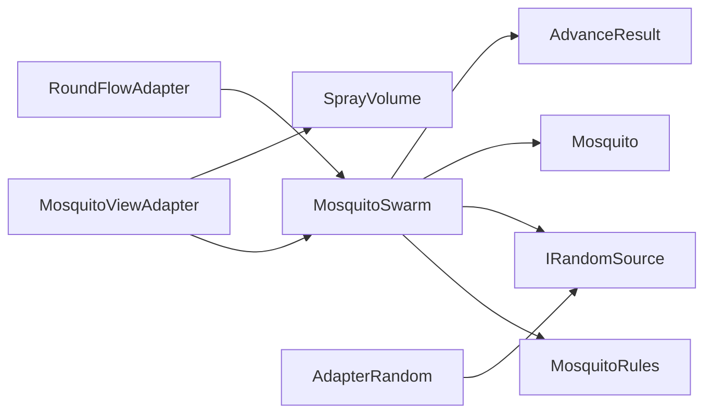
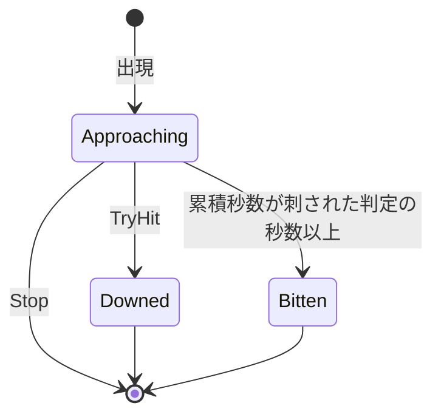
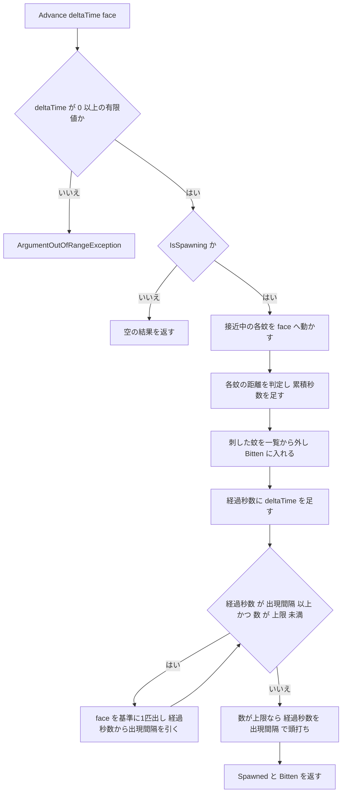

# Design Document — mosquito-core

## Overview
**Purpose**: 蚊の出現・顔への接近・撃墜・刺された判定の規則を、UnityEngine に依存しない計算として `MosquitoSpray.Core` に置く。EditMode テストだけで規則を確かめられるようにする。
**Users**: 下流の mosquito-view-adapter は、時間経過と顔の位置を渡して蚊の位置と状態を受け取る。また、命中した蚊を知らせる。round-flow-adapter は、出現の開始・停止を指示し、撃墜・刺されたことをスコアへ渡す。開発者は、テストの結果で規則が正しいかを判断する。
**Impact**: `MosquitoSpray.Core` に名前空間 `MosquitoSpray.Core.Mosquitoes` を加える。既存の `SprayVolume` は変更しない。

蚊1匹の状態は「接近中 → 撃墜」または「接近中 → 刺した」で終わる。刺された判定の秒数は蚊ごとに累積し、範囲を出ても 0 に戻さない。
数値はすべて仮の初期値で、Core は既定値を持たない（requirements.md Introduction の表）。値を調整したら、コードより先に requirements.md の表とこの文書を直す。

### Goals
- 経過秒数と顔の位置を渡すと、出現・移動・刺された判定が規則どおりに進む
- 命中を知らせると、接近中の蚊だけが撃墜になる
- 壊れた設定値と負の経過秒数を、その場で拒否する
- 乱数を固定したテストで、出現の位置と順番が決まる

### Non-Goals
- 命中の判定（spray-hit-core の `SprayVolume.Contains`。呼ぶのは Adapter）
- 設定値の保持と調整（Adapter 側の ScriptableObject）
- 乱数の本番の実装（Adapter が `IRandomSource` を実装する）
- 撃墜した蚊の落下、刺された演出、スコアの増減
- `UnityEngine.Vector3` との変換

## Boundary Commitments

### This Spec Owns
- 出現の規則：開始と停止、出現の位置（顔からの水平距離と高さ）、同時数、出現間隔
- 蚊1匹の状態遷移（接近中 → 撃墜／刺した）と、顔への接近の動き
- 刺された判定：顔からの距離と、蚊ごとの累積秒数
- 1回の時間経過の中の処理の順序（移動 → 刺された判定 → 出現）
- 設定値と経過秒数の検証、不正な値の知らせ方
- Core における座標の決まり：**Y 軸が上**。水平距離は XZ 平面上の距離

### Out of Boundary
- どの蚊が命中したかを決めること。Adapter が `SprayVolume.Contains` で判定し、結果を `TryHit` で知らせる
- 出現をいつ開始・停止するかの判断（round-flow-adapter が、ラウンドの状態に合わせて指示する）
- 顔の位置を取得すること（Adapter が頭の姿勢から渡す）
- 撃墜・刺されたことのスコアへの反映（round-core）。この spec は round-core を参照しない
- 撃墜後の蚊の扱い（落下・消去の時機）。Core は撃墜した時点で蚊を一覧から外し、それ以上は何もしない
- 家具や壁との当たり判定、逃避などの外部設計にない飛び方、難易度の変化

### Allowed Dependencies
- `System`（例外型、`MathF`）
- `System.Collections.Generic`（一覧）
- `System.Numerics`（`Vector3`。spray-hit-core と同じ型）
- `MosquitoSpray.Core.Spray` は参照しない。命中の判定は Adapter がつなぐ
- これ以外の参照を足さない。UnityEngine は asmdef が拒否する
- テストは `MosquitoSpray.Tests.EditMode` に置き、NUnit と `MosquitoSpray.Core` だけを使う

### Revalidation Triggers
- `MosquitoSwarm` の公開メンバー（`Start` / `Stop` / `Advance` / `TryHit` / `Mosquitoes` / `IsSpawning`）のシグネチャ変更 → mosquito-view-adapter
- `AdvanceResult` と `Mosquito` の公開プロパティの変更（撃墜・刺されのイベントの形） → mosquito-view-adapter、round-flow-adapter
- `MosquitoRules` のコンストラクタ引数と受け付ける範囲の変更 → mosquito-view-adapter の ScriptableObject と、その検証
- 上方向の軸（Y が上）の変更 → mosquito-view-adapter の座標変換
- 撃墜・刺した蚊を一覧から外す時機の変更 → mosquito-view-adapter の表示の同期
- `IRandomSource` の契約（`[0, 1)`、引く順番）の変更 → Adapter の乱数の実装と、出現位置を固定したテスト

## Architecture

### Architecture Pattern & Boundary Map



**Architecture Integration**:
- Selected pattern: 外から時間を進める状態機械。`MosquitoSwarm` が唯一の公開の入口で、時計を持たない
- Domain/feature boundaries:
  - `MosquitoSwarm`：出現の規則と、1回の時間経過の順序を持つ
  - `Mosquito`：蚊1匹の状態・接近・累積秒数を持つ
  - `MosquitoRules`：設定値の検証を持つ
- Existing patterns preserved：
  - spray-hit-core と同じく、検証はコンストラクタに集めて例外と `ParamName` で知らせる
  - 位置は `System.Numerics.Vector3`
  - 境界ちょうどの比較に、公開しない許容誤差を入れる
  - 名前空間はフォルダと一致させる
- New components rationale: 下の Components の表を参照。出現ルール・蚊・刺された判定を別々の公開型にしない理由は research.md「Architecture Pattern Evaluation」
- Steering compliance: tech.md「L1 Core」「単位」「禁止事項 1」、structure.md「`Assets/Scripts/Core/`」「調整しうる数値はコードに直書きしない」

### Technology Stack

| Layer | Choice / Version | Role in Feature | Notes |
|-------|------------------|-----------------|-------|
| Domain (L1 Core) | C# / `System.Numerics.Vector3` | 位置、距離、正規化 | spray-hit-core と同じ。追加パッケージなし |
| Test | Unity Test Framework（NUnit） | EditMode テスト | `[Test]` と `[TestCase]` のみ。`[UnityTest]` は使わない |

## File Structure Plan

### Directory Structure
```
Assets/
├── Scripts/Core/
│   └── Mosquitoes/                          # namespace MosquitoSpray.Core.Mosquitoes
│       ├── MosquitoRules.cs                 # 設定値9つの保持と検証
│       ├── IRandomSource.cs                 # [0, 1) の乱数を返すインターフェース
│       ├── MosquitoState.cs                 # 接近中・撃墜・刺した の列挙
│       ├── Mosquito.cs                      # 蚊1匹：識別子・位置・状態・累積秒数と、internal の接近・刺された判定・撃墜
│       ├── AdvanceResult.cs                 # 1回の時間経過で新たに出現した蚊と刺した蚊
│       └── MosquitoSwarm.cs                 # 公開の入口：開始・停止・時間経過・命中、出現の規則
└── Tests/EditMode/
    └── Mosquitoes/                          # namespace MosquitoSpray.Tests.EditMode.Mosquitoes
        ├── FixedRandomSource.cs             # テスト用：決めた値を順に返す IRandomSource
        ├── MosquitoRulesTests.cs            # MosquitoRules の生成と拒否
        ├── MosquitoSwarmTests.cs            # partial：共通の準備（既定の Rules、生成ヘルパー）と、開始・停止・経過秒数の検証
        ├── MosquitoSwarmTests.Spawn.cs      # partial：出現の位置・同時数・出現間隔
        ├── MosquitoSwarmTests.Flight.cs     # partial：顔への接近
        ├── MosquitoSwarmTests.Hit.cs        # partial：命中を受けての撃墜と、空いた枠の出現（実装で Flight から分けた）
        └── MosquitoSwarmTests.Bite.cs       # partial：刺された判定と、刺したあとの蚊
```

`.meta` は Unity が生成する。手で作らない（tech.md 禁止事項 2）。
`MosquitoSwarmTests` を partial に分けるのは、ファイルが大きくなりすぎないようにするため。分けても命名規約 `<対象クラス名>Tests` は保たれる。

### Modified Files
- なし（asmdef、`SprayVolume` ともに変更しない）

## System Flows

### 蚊1匹の状態



- Downed / Bitten になった時点で、蚊は `Mosquitoes` から外れる。その後、状態と位置は変わらない（5.2, 5.4, 7.1）
- `Stop` で取り除かれた蚊の状態は Approaching のまま残る。Stop は撃墜でも刺されでもないため（1.3）

### 1回の時間経過（`Advance`）



- 経過秒数は「直前の出現からの秒数」。`Start` で出現間隔と同じ値にしておくので、最初の `Advance` で1匹目が出る（1.2）。これは経過秒数が 0 のときも同じ
- 頭打ちにより、上限に達している間は待ち時間が貯まらない。空きができたら次の `Advance` で1匹だけ出る。2匹目は出現間隔を待つ（3.2, 3.3）
- 刺して消えた枠は、同じ `Advance` の出現判定で使える
- 出現したばかりの蚊は、その `Advance` では動かず、累積秒数も足されない

## Requirements Traceability

| Requirement | Summary | Components | Interfaces | Flows |
|-------------|---------|------------|------------|-------|
| 1.1 | 開始前は出現しない | MosquitoSwarm | `Advance`、`IsSpawning` | 時間経過 |
| 1.2 | 開始後、最初の時間経過で1匹 | MosquitoSwarm | `Start`、`Advance` | 時間経過 |
| 1.3 | 停止で全部取り除き、以後出さない | MosquitoSwarm | `Stop` | 状態 |
| 1.4 | 再開で前回を引き継がない | MosquitoSwarm | `Start` | — |
| 2.1 | 水平距離が出現範囲内 | MosquitoSwarm, MosquitoRules | `Advance`（出現位置） | 時間経過 |
| 2.2 | 高さの差が出現範囲内 | MosquitoSwarm, MosquitoRules | `Advance`（出現位置） | 時間経過 |
| 2.3 | 位置を差し替え可能な乱数で決める | IRandomSource, MosquitoSwarm | `IRandomSource.NextFloat` | — |
| 2.4 | 同じ乱数と入力なら同じ位置・順番 | MosquitoSwarm | 乱数を引く順番の固定 | — |
| 3.1 | 上限未満かつ間隔経過で1匹 | MosquitoSwarm | `Advance` | 時間経過 |
| 3.2 | 上限なら出さない | MosquitoSwarm | `Advance`（頭打ち） | 時間経過 |
| 3.3 | 空きができたら次の時間経過で1匹 | MosquitoSwarm | `Advance`、`TryHit` | 時間経過 |
| 3.4 | 長い時間経過で間隔の数だけ、上限まで | MosquitoSwarm | `Advance`（ループ） | 時間経過 |
| 3.5 | 撃墜・刺した蚊を同時数に数えない | MosquitoSwarm | `Mosquitoes` から外す | 状態 |
| 4.1 | 顔へまっすぐ 速さ×秒数 動く | Mosquito, MosquitoSwarm | `Advance` | 時間経過 |
| 4.2 | 顔を通り過ぎない | Mosquito | `Advance` | — |
| 4.3 | 新しい顔の位置へ向かう | Mosquito | `Advance` の `face` 引数 | — |
| 4.4 | 経過秒数 0 で位置も状態も変えない | Mosquito, MosquitoSwarm | `Advance` | — |
| 4.5 | 家具や壁でさえぎらない | Mosquito | 当たり判定を持たない | — |
| 5.1 | 命中で撃墜、読み取れる | Mosquito, MosquitoSwarm | `TryHit` | 状態 |
| 5.2 | 撃墜した蚊は動かず、秒数も足さない | MosquitoSwarm | `Mosquitoes` から外す | 状態 |
| 5.3 | 撃墜済み・刺した・存在しない蚊への命中は無視 | MosquitoSwarm | `TryHit` が false | — |
| 5.4 | 撃墜された位置を読める | Mosquito | `Position`（撃墜後は不変） | — |
| 6.1 | 距離以下なら秒数を足す | Mosquito | `Advance` | 時間経過 |
| 6.2 | 範囲外では増やさず 0 にも戻さない | Mosquito | `BiteTime` | 時間経過 |
| 6.3 | 累積が秒数以上で刺した | Mosquito, MosquitoSwarm | `AdvanceResult.Bitten` | 状態 |
| 6.4 | 距離ちょうどは範囲内 | Mosquito | 許容誤差つきの比較 | — |
| 6.5 | 累積は蚊ごと | Mosquito | `BiteTime` を蚊ごとに持つ | — |
| 7.1 | 刺した蚊は動かず、判定の対象外 | MosquitoSwarm | `Mosquitoes` から外す、`TryHit` が false | 状態 |
| 7.2 | 刺されたことは1匹1回 | MosquitoSwarm | 外した蚊は再判定しない | 状態 |
| 7.3 | 同じ時間経過で複数刺せば、その数だけ読める | AdvanceResult | `Bitten` の要素数 | — |
| 8.1 | 識別子・位置・状態を読める | Mosquito, MosquitoSwarm | `Id` / `Position` / `State`、`Mosquitoes` | — |
| 8.2 | 新たに出現した蚊・刺した蚊を読める | AdvanceResult | `Spawned` / `Bitten` | — |
| 8.3 | 撃墜された蚊を読める | MosquitoSwarm | `TryHit` の `out` 引数 | — |
| 8.4 | 識別子を変えず、使い回さない | MosquitoSwarm | 単調に増やす `Id` | — |
| 9.1 | 距離・秒数・間隔・速さ ≤ 0 を拒否 | MosquitoRules | コンストラクタ | — |
| 9.2 | 水平距離の範囲が不正なら拒否 | MosquitoRules | コンストラクタ | — |
| 9.3 | 高さの範囲が不正なら拒否 | MosquitoRules | コンストラクタ | — |
| 9.4 | 同時数 < 1 を拒否 | MosquitoRules | コンストラクタ | — |
| 9.5 | 負の経過秒数を拒否し、何も変えない | MosquitoSwarm | `Advance` | 時間経過 |
| 10.1 | シーンを起動せずに確かめられる | 全テスト | EditMode `[Test]` | — |
| 10.2 | 公開する操作すべてにテスト | 全テスト | — | — |
| 10.3 | 乱数を固定して出現を確かめる | FixedRandomSource, MosquitoSwarmTests | — | — |
| 10.4 | 境界4ケースを固定 | MosquitoSwarmTests | — | — |
| 10.5 | 仮の初期値以外でも成り立つ | MosquitoRulesTests, MosquitoSwarmTests | — | — |

## Components and Interfaces

| Component | Domain/Layer | Intent | Req Coverage | Key Dependencies | Contracts |
|-----------|--------------|--------|--------------|------------------|-----------|
| MosquitoRules | Mosquitoes / L1 Core | 設定値9つを検証して持つ | 9.1–9.4 | System (P0) | State |
| IRandomSource | Mosquitoes / L1 Core | 出現位置の乱数を差し替え可能にする | 2.3 | — | Service |
| MosquitoState | Mosquitoes / L1 Core | 蚊の状態の列挙 | 8.1 | — | State |
| Mosquito | Mosquitoes / L1 Core | 蚊1匹の位置・状態・累積秒数と、その変化 | 4.1–4.5, 5.1, 5.4, 6.1–6.5, 8.1 | System.Numerics (P0) | State |
| AdvanceResult | Mosquitoes / L1 Core | 1回の時間経過で起きたことを渡す | 7.3, 8.2 | Mosquito (P0) | Event |
| MosquitoSwarm | Mosquitoes / L1 Core | 公開の入口。出現の規則と時間経過の順序 | 1.1–1.4, 2.1–2.4, 3.1–3.5, 5.2, 5.3, 7.1, 7.2, 8.3, 8.4, 9.5 | MosquitoRules (P0), IRandomSource (P0), Mosquito (P0) | Service, State, Event |
| FixedRandomSource | Mosquitoes / EditMode Test | 決めた値を順に返す | 10.3 | IRandomSource (P0) | — |
| MosquitoRulesTests / MosquitoSwarmTests | Mosquitoes / EditMode Test | 規則と境界をテストで固定する | 10.1–10.5（と 1〜9 の検証） | NUnit (P0) | — |

### Mosquitoes / L1 Core

#### MosquitoRules

| Field | Detail |
|-------|--------|
| Intent | 刺された判定・出現・接近の設定値を検証済みの状態で持つ |
| Requirements | 9.1, 9.2, 9.3, 9.4 |

**Responsibilities & Constraints**
- 検証はコンストラクタだけで行う。作られた `MosquitoRules` は常に有効
- 不変。`sealed class` にする（`default` で検証を迂回できないように。spray-hit-core と同じ理由）
- 既定値を持たない。仮の初期値はテストと Adapter の ScriptableObject が持つ

**Dependencies**
- Inbound: mosquito-view-adapter — ScriptableObject の値から作る (P0)
- Inbound: MosquitoSwarm — 値を読む (P0)

**Contracts**: State [x]

```csharp
namespace MosquitoSpray.Core.Mosquitoes
{
    public sealed class MosquitoRules
    {
        // 検査は引数の並び順に行い、最初に見つかった不正な値で例外を投げる。範囲は「受け付ける範囲に入っていなければ拒否」で書き、NaN と無限大も拒否する
        //   ArgumentOutOfRangeException (ParamName = "biteDistance")    0 < biteDistance の有限値でない
        //   ArgumentOutOfRangeException (ParamName = "biteDuration")    0 < biteDuration の有限値でない
        //   ArgumentOutOfRangeException (ParamName = "spawnMinRadius")  0 ≤ spawnMinRadius の有限値でない
        //   ArgumentOutOfRangeException (ParamName = "spawnMaxRadius")  spawnMinRadius ≤ spawnMaxRadius の有限値でない
        //   ArgumentOutOfRangeException (ParamName = "spawnMinHeight")  有限値でない
        //   ArgumentOutOfRangeException (ParamName = "spawnMaxHeight")  spawnMinHeight ≤ spawnMaxHeight の有限値でない
        //   ArgumentOutOfRangeException (ParamName = "maxCount")        1 ≤ maxCount でない
        //   ArgumentOutOfRangeException (ParamName = "spawnInterval")   0 < spawnInterval の有限値でない
        //   ArgumentOutOfRangeException (ParamName = "approachSpeed")   0 < approachSpeed の有限値でない
        public MosquitoRules(
            float biteDistance,     // m。顔からこの距離以下で秒数を足す
            float biteDuration,     // 秒。累積がこれ以上で刺す
            float spawnMinRadius,   // m。顔からの水平距離の下限
            float spawnMaxRadius,   // m。顔からの水平距離の上限
            float spawnMinHeight,   // m。顔の高さとの差の下限（負でよい）
            float spawnMaxHeight,   // m。顔の高さとの差の上限
            int maxCount,           // 匹。接近中の蚊の上限
            float spawnInterval,    // 秒。出現どうしの最短間隔
            float approachSpeed);   // m/s。顔へ近づく速さ

        public float BiteDistance { get; }
        public float BiteDuration { get; }
        public float SpawnMinRadius { get; }
        public float SpawnMaxRadius { get; }
        public float SpawnMinHeight { get; }
        public float SpawnMaxHeight { get; }
        public int MaxCount { get; }
        public float SpawnInterval { get; }
        public float ApproachSpeed { get; }
    }
}
```
- 要件 9.2 / 9.3 の「出現範囲が不正」は、`ParamName` が `spawnMinRadius` / `spawnMaxRadius` / `spawnMaxHeight` のいずれかになることで知らせる
- 内側と外側が等しい水平距離、下限と上限が等しい高さは受け付ける（要件は「より小さい／より大きい」ときだけを拒否している）

#### IRandomSource

| Field | Detail |
|-------|--------|
| Intent | 出現位置を決める乱数を、テストで固定できるようにする |
| Requirements | 2.3 |

**Contracts**: Service [x]

```csharp
namespace MosquitoSpray.Core.Mosquitoes
{
    public interface IRandomSource
    {
        // 0 以上 1 未満の値を返す
        float NextFloat();
    }
}
```
- 本番の実装は Adapter に置く。Core には実装を置かない（使うのは Adapter とテストだけで、Core の中で選ぶ場面がない）
- `MosquitoSwarm` は、範囲外や NaN が返っても出現範囲を守れるよう、受け取った値を `[0, 1]` に切り詰める。NaN は 0 とみなす

#### Mosquito / MosquitoState

| Field | Detail |
|-------|--------|
| Intent | 蚊1匹の識別子・位置・状態・累積秒数を持ち、接近・刺された判定・撃墜で変わる |
| Requirements | 4.1, 4.2, 4.3, 4.4, 4.5, 5.1, 5.4, 6.1, 6.2, 6.3, 6.4, 6.5, 8.1 |

**Responsibilities & Constraints**
- 公開するのは読み取り専用のプロパティだけ。変更する操作は `internal` にし、`MosquitoSwarm` からだけ呼ぶ
- 状態が Approaching でない蚊は、どの操作でも変わらない
- 家具・壁・ほかの蚊との当たり判定を持たない（4.5）

**Contracts**: State [x]

```csharp
namespace MosquitoSpray.Core.Mosquitoes
{
    public enum MosquitoState { Approaching, Downed, Bitten }

    public sealed class Mosquito
    {
        public int Id { get; }               // 群れの中で一意。変わらない
        public Vector3 Position { get; }     // m。Downed / Bitten のあとは変わらない
        public MosquitoState State { get; }
        public float BiteTime { get; }       // 秒。顔の近くにいた累積秒数。減らない

        internal Mosquito(int id, Vector3 position);
        // 接近中なら顔へ動かし、刺された判定をする。刺したら true
        internal bool Advance(float deltaTime, Vector3 face, MosquitoRules rules);
        // 接近中なら Downed にして true
        internal bool Down();
    }
}
```

`Advance` の事後条件（接近中のときだけ。そうでなければ何もせず `false`）：
- 接近：`d = |face − Position|`、`s = ApproachSpeed × deltaTime`。`d ≤ s` なら `Position = face`（4.2）。そうでなければ `Position += (face − Position) / d × s`（4.1, 4.3）。`d = 0` のときは動かさない
- 刺された判定：動いたあとの `|face − Position| ≤ BiteDistance + DistanceTolerance` なら `BiteTime += deltaTime`（6.1, 6.4）。そうでなければ `BiteTime` を変えない（6.2）
- `BiteTime ≥ BiteDuration − TimeTolerance` なら `State = Bitten` にして `true` を返す（6.3）
- `deltaTime = 0` のとき、位置・累積秒数・状態は変わらない（4.4）。ただし、すでに `BiteTime ≥ BiteDuration` の接近中の蚊はありえない（足した時点で刺すため）

#### AdvanceResult

| Field | Detail |
|-------|--------|
| Intent | 1回の時間経過で新たに出現した蚊と、新たに刺した蚊を渡す |
| Requirements | 7.3, 8.2 |

**Contracts**: Event [x]

```csharp
namespace MosquitoSpray.Core.Mosquitoes
{
    public sealed class AdvanceResult
    {
        public IReadOnlyList<Mosquito> Spawned { get; }  // 出現した順
        public IReadOnlyList<Mosquito> Bitten { get; }   // 刺した蚊。State == Bitten、Position は刺した位置
    }
}
```
- Published events: 出現（`Spawned`）、刺された（`Bitten`）。撃墜は `TryHit` の戻り値で渡す
- Ordering / delivery guarantees: `Bitten` は `Mosquitoes` の並び順（出現した順）。同じ蚊が2回の結果に入ることはない（7.2）
- 刺されたときの減点は、round-flow-adapter が `Bitten.Count` 回だけ round-core に渡す（7.3）

#### MosquitoSwarm

| Field | Detail |
|-------|--------|
| Intent | 出現の開始と停止、時間経過、命中を受け付ける唯一の公開の入口 |
| Requirements | 1.1, 1.2, 1.3, 1.4, 2.1, 2.2, 2.3, 2.4, 3.1, 3.2, 3.3, 3.4, 3.5, 5.2, 5.3, 7.1, 7.2, 8.3, 8.4, 9.5 |

**Responsibilities & Constraints**
- 時計を持たない。時間は `Advance` の `deltaTime` でだけ進む
- `Mosquitoes` は接近中の蚊だけを、出現した順に持つ。撃墜・刺した蚊は、その時点で外す（3.5, 5.2, 7.1）
- 1回の `Advance` の順序は「移動と刺された判定 → 刺した蚊を外す → 出現」（System Flows）
- 乱数は、出現1匹につき「角度 → 水平距離 → 高さ」の順で3回引く（2.4）。`θ = 2π·u1`、`r = SpawnMinRadius + (SpawnMaxRadius − SpawnMinRadius)·u2`、`h = SpawnMinHeight + (SpawnMaxHeight − SpawnMinHeight)·u3` とし、出現位置は `face + (r·cos θ, h, r·sin θ)`

**Dependencies**
- Inbound: mosquito-view-adapter — `Advance`・`TryHit`・`Mosquitoes` (P0)
- Inbound: round-flow-adapter — `Start`・`Stop`（ラウンドの開始・終了に合わせる） (P0)
- Outbound: MosquitoRules、IRandomSource、Mosquito (P0)

**Contracts**: Service [x] / Event [x] / State [x]

```csharp
namespace MosquitoSpray.Core.Mosquitoes
{
    public sealed class MosquitoSwarm
    {
        // ArgumentNullException (ParamName = "rules" / "random")
        public MosquitoSwarm(MosquitoRules rules, IRandomSource random);

        public MosquitoRules Rules { get; }
        public bool IsSpawning { get; }
        public IReadOnlyList<Mosquito> Mosquitoes { get; }  // 接近中の蚊。出現した順

        // 蚊をすべて取り除き、経過秒数を出現間隔と同じ値にして出現を始める。開始中に呼んでも同じ（やり直し）
        public void Start();

        // 蚊をすべて取り除き、出現を止める。止まっているときに呼んでも何もしない
        public void Stop();

        // ArgumentOutOfRangeException (ParamName = "deltaTime") 0 ≤ deltaTime の有限値でない。このとき何も変えない
        public AdvanceResult Advance(float deltaTime, Vector3 face);

        // 接近中の蚊なら撃墜にして一覧から外し、true と、その蚊を返す
        // 撃墜済み・刺した・存在しない・停止中に取り除かれた蚊なら false と null を返す
        public bool TryHit(int id, out Mosquito downed);
    }
}
```
- Preconditions: `Advance` の `face` の値は検証しない（NaN の顔の位置は要件外。保証しない）
- Postconditions:
  - `IsSpawning == false` の間の `Advance` は、検証のあと空の結果を返す。蚊は存在しない（1.1, 1.3）
  - `Start` の直後の `Advance` は、`deltaTime` によらず少なくとも1匹出す（1.2）
  - `Advance` のあと `Mosquitoes.Count ≤ Rules.MaxCount`（3.2, 3.4）
  - 出現位置 `p` は `SpawnMinRadius ≤ |(p − face).XZ| ≤ SpawnMaxRadius` かつ `SpawnMinHeight ≤ p.Y − face.Y ≤ SpawnMaxHeight` を満たす（`face` はその `Advance` の値。2.1, 2.2）
- Invariants: `Id` は 1 から始まり、出現のたびに 1 増える。`Start` / `Stop` で戻さない（8.4）

##### State Management
- State model: `IsSpawning`、接近中の蚊の一覧、直前の出現からの経過秒数、次の識別子
- `Start` は一覧と経過秒数を初期化する。次の識別子は戻さない（1.4, 8.4）
- Concurrency strategy: スレッドセーフではない。Adapter は1つのスレッド（Unity のメインスレッド）から呼ぶ

**Implementation Notes**
- Integration: mosquito-view-adapter は毎フレーム `Advance(Time.deltaTime, 顔の位置)` を呼び、`Spawned` からプレハブを作る。また `Mosquitoes` の位置を反映する。噴射のたびに、各蚊について `SprayVolume.Contains(m.Position)` を判定し、当たれば `TryHit(m.Id, out var downed)` を呼ぶ。一覧を回しながら `TryHit` を呼ぶと一覧が変わるので、先に命中した識別子を集めてから呼ぶ
- Validation: 許容誤差は `DistanceTolerance = 1e-5f`（m）、`TimeTolerance = 1e-5f`（秒）。どちらも `private const` にし、公開しない
- Risks: 1回の `deltaTime` が非常に大きいと、蚊は一度に顔まで進み、同じ `Advance` でその秒数がまるごと累積に入る。毎フレーム呼ぶ前提では起きない。要件 6.1 の文言どおりの結果でもある

## Error Handling

### Error Strategy
不正な設定値と経過秒数は、例外にしてその場で止める（Fail Fast）。どちらも設定ミスかバグのときにしか来ず、ゲーム中の通常の経路にはない。`TryHit` は例外を投げず、`false` で「何も起きなかった」ことを知らせる（5.3）。存在しない識別子は、撃墜済みの蚊と見分けがつかなくてよい。

### Error Categories and Responses

| 状況 | 例外 | ParamName | 要件 |
|------|------|-----------|------|
| 刺された判定の距離・秒数、出現間隔、接近の速さが 0 以下（NaN・無限大を含む） | `ArgumentOutOfRangeException` | `biteDistance` / `biteDuration` / `spawnInterval` / `approachSpeed` | 9.1 |
| 内側の水平距離が 0 未満、外側が内側未満 | `ArgumentOutOfRangeException` | `spawnMinRadius` / `spawnMaxRadius` | 9.2 |
| 高さの下限が上限より大きい（いずれかが NaN・無限大を含む） | `ArgumentOutOfRangeException` | `spawnMinHeight` / `spawnMaxHeight` | 9.3 |
| 同時数の上限が 1 未満 | `ArgumentOutOfRangeException` | `maxCount` | 9.4 |
| 経過秒数が負（NaN・無限大を含む） | `ArgumentOutOfRangeException` | `deltaTime` | 9.5 |
| `rules` / `random` が null | `ArgumentNullException` | `rules` / `random` | — |

### Monitoring
Core はログを出さない。例外のログ出力は、呼び出し側（Adapter）の責任。

## Testing Strategy

すべて `[Test]` / `[TestCase]`。顔の位置は原点以外（例 `(0.5, 1.2, -0.3)`）も使い、顔の位置を差し引き忘れる誤りを検出する。
仮の初期値の Rules（0.3m、2.0秒、1.0〜2.0m、±0.5m、3匹、2.0秒、0.5m/s）を `MosquitoSwarmTests` の共通の準備に置く。蚊1匹だけを扱うテストでは、上限を 1 にした Rules を使う。
刺された判定を確かめるテスト以外は、**刺さない Rules**（仮の初期値のうち `biteDuration` だけ 1000 秒）を使う。仮の初期値のままだと、出現・接近・撃墜のテストの途中で蚊が顔に着いて刺し、枠が空いて結果が変わるため。時間を細かく刻むときは 1/64 秒（float で誤差なく表せる）を使う。

### MosquitoRulesTests（9.1–9.4, 10.5）
- 仮の初期値で作ると、9つのプロパティが渡した値と等しい
- 仮の初期値以外の組で作れる。内側 = 外側の水平距離と、下限 = 上限の高さも受け付ける（例：0.1m、0.5秒、0〜0m、0〜0m、1匹、0.1秒、3m/s）
- `biteDistance` / `biteDuration` / `spawnInterval` / `approachSpeed` が `0 / -1 / NaN` → 各 `ParamName`（9.1）
- `spawnMinRadius = -0.1` → `spawnMinRadius`。`spawnMaxRadius < spawnMinRadius` → `spawnMaxRadius`（9.2）
- `spawnMinHeight > spawnMaxHeight` → `spawnMaxHeight`（9.3）
- `maxCount = 0 / -1` → `maxCount`（9.4）

### 開始・停止・経過秒数（MosquitoSwarmTests.cs。1.1–1.4, 9.5）
- 作った直後は `IsSpawning == false`。`Advance(5, face)` しても `Mosquitoes` は空で、`Spawned` も空（1.1）
- `Start` → `Advance(0.015625, face)` で1匹出る。`Advance(0, face)` でも1匹出る（1.2）
- 2匹以上いる状態で `Stop` すると `Mosquitoes` は空になる。その後 `Advance(10, face)` しても出ない（1.3）
- `Stop` → `Start` → `Advance` で、最初の開始と同じ乱数なら同じ位置に1匹だけ出る。新しい蚊の `Id` は前の蚊と重ならない（1.4, 8.4）
- `Advance(-0.1 / NaN / +∞, face)` → `ArgumentOutOfRangeException`、`ParamName == "deltaTime"`。蚊の位置と数は呼ぶ前と同じ（9.5）
- `MosquitoSwarm(null, random)` / `(rules, null)` → `ArgumentNullException`

### 出現（MosquitoSwarmTests.Spawn.cs。2.1–2.4, 3.1–3.5, 8.2, 8.4）
- 乱数 `(0, 0, 0)` → 角度 0・内側の距離・高さの下限：位置は `face + (1.0, -0.5, 0)`（2.1, 2.2, 10.3）
- 乱数 `(0.25, 1, 1)` → `face + (0, 0.5, 2.0)`（許容誤差つきで比較。2.1, 2.2）
- 乱数の値をいくつか変えて100匹ぶん出し、すべて水平距離 1.0〜2.0m、高さの差 ±0.5m に入る（2.1, 2.2）
- `FixedRandomSource` が範囲外（`1.5`、`-0.5`、NaN）を返しても、出現範囲に入る（2.3）
- 同じ乱数の並びで2つの群れを同じように進めると、出現の位置と順番が等しい（2.4）
- 刺さない Rules で 1/64 秒ずつ進めると、出現は t=0, 2.0, 4.0 秒で、4匹目は出ない（3.1, 3.2）。`Spawned` にその時間経過で出た蚊だけが入る（8.2）
- 刺さない Rules で3匹いる状態から10秒進め、1匹を `TryHit` すると、次の `Advance(1/64)` で1匹出る。続けて2匹を撃墜しても、次の `Advance(1/64)` では出ない。2匹目は出現間隔を待つ（3.2, 3.3）
- `Start` 直後に `Advance(5)` すると、出るのは3匹（t=0, 2, 4 ぶん）。`Advance(100)` でも3匹（3.4）
- 撃墜した蚊は `Mosquitoes` から外れ、`Count` が1減る（3.5）
- 出現した蚊の `Id` はすべて異なり、出現した順に増える（8.4）

### 接近と撃墜（MosquitoSwarmTests.Flight.cs と .Hit.cs。4.1–4.5, 5.1–5.4, 8.1, 8.3）
- 顔から 1.5m の蚊を 1秒進めると、顔へまっすぐ 0.5m 近づく（4.1）
- 顔から 0.2m の蚊を 1秒進めると、位置は顔の位置になり、通り過ぎない（4.2, 10.4）
- 進める途中で顔の位置を横へ動かすと、蚊は新しい顔の位置へ向かう（4.3）
- `Advance(0)` で、位置・状態・`BiteTime` が変わらない（4.4）
- 出現した蚊の `State == Approaching`、`Id` と `Position` を読める（8.1）
- `TryHit(id)` は `true` を返し、`downed.State == Downed`、`downed.Position` は撃墜した時点の位置。その後 `Advance` しても `downed` の位置は変わらない（5.1, 5.2, 5.4, 8.3）
- 撃墜済み・存在しない識別子・`Stop` 後の識別子への `TryHit` は `false` と `null`（5.3）
- 撃墜した蚊は、顔の位置のまま何秒進めても `Bitten` に入らない（5.2）

### 刺された判定（MosquitoSwarmTests.Bite.cs。6.1–6.5, 7.1–7.3, 10.4, 10.5）
- 蚊を顔の位置に着かせてから 2.0 秒経つと、その `Advance` の `Bitten` に入り、`State == Bitten` になる。`Mosquitoes` から外れる（6.1, 6.3, 7.1）
- 1.99 秒では刺さない（6.3）。0.1 秒×20回でも刺す（float の累積誤差があっても許容誤差で刺す。10.4「累積秒数ちょうど」）
- 出現範囲を水平 0.3m・高さ 0m に固定した Rules で、顔から 0.3m の位置に出す。以後は `Advance` のたびに、顔を蚊から遠ざける向きへ「接近の速さ×経過秒数」だけ動かし、移動後の距離を 0.3m に保つ。この蚊は秒数を足される。同じ手順で 0.301m に保つと足されない（6.4, 10.4「距離ちょうど」）
- 接近の速さ 0.1m/s の Rules で、顔の位置に蚊を出し（下記）、1.0 秒進める。次に顔を 1m 離して 3 秒進める（蚊は 0.3m しか近づけない）。最後に顔を蚊の位置に戻して 1.0 秒進めると刺す。離れている間 `BiteTime` は 1.0 のまま（6.2, 10.4「出入りしたあとの累積」）
- 2匹のうち片方だけが顔の近くにいるとき、もう片方の `BiteTime` は 0 のまま（6.5）
- 刺した蚊の識別子への `TryHit` は `false`。以後の `Advance` で同じ蚊が `Bitten` に入らない（7.1, 7.2）
- 出現間隔 0.1 秒の Rules で `Start` → `Advance(0.1)` とし、顔の位置に2匹を同時に出す。続けて `Advance(2.0)` すると `Bitten.Count == 2`（7.3）
- 仮の初期値以外の Rules（0.1m、0.5秒、速さ 3m/s）で、刺されるまでの秒数が変わる（10.5）

### 実行（10.1, 10.2）
- 公開メンバー（`MosquitoRules` のコンストラクタと9つのプロパティ、`MosquitoSwarm` のコンストラクタ・`Rules`・`IsSpawning`・`Mosquitoes`・`Start`・`Stop`・`Advance`・`TryHit`、`Mosquito` の4つのプロパティ、`AdvanceResult` の2つのプロパティ）のどれにも、少なくとも1本のテストがある（10.2）
- Stop フック（EditMode）で全件が通ることを完了条件にする（10.1）

テストで蚊を顔の位置に出すには、出現範囲を水平 0〜0m・高さ 0〜0m にした Rules を使う（`MosquitoRules` が受け付ける値）。出現した `Advance` では累積秒数が足されないので、刺されるまでの秒数は次の `Advance` から数える。
