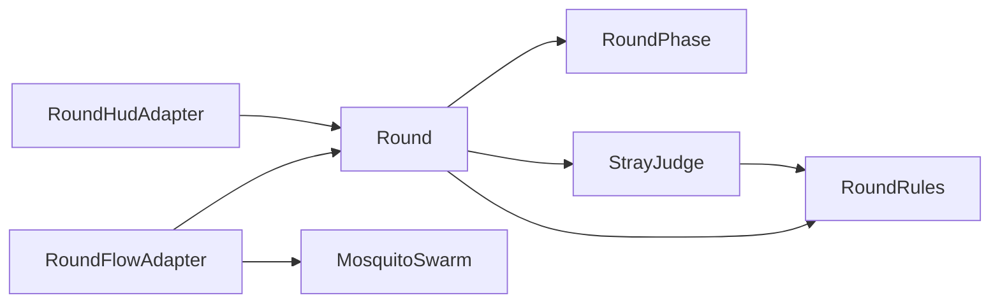
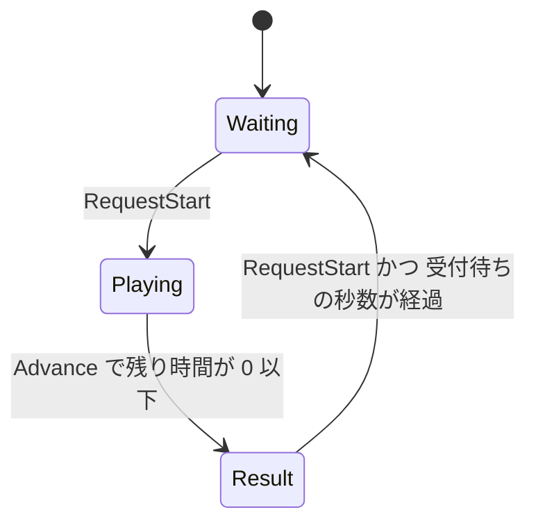
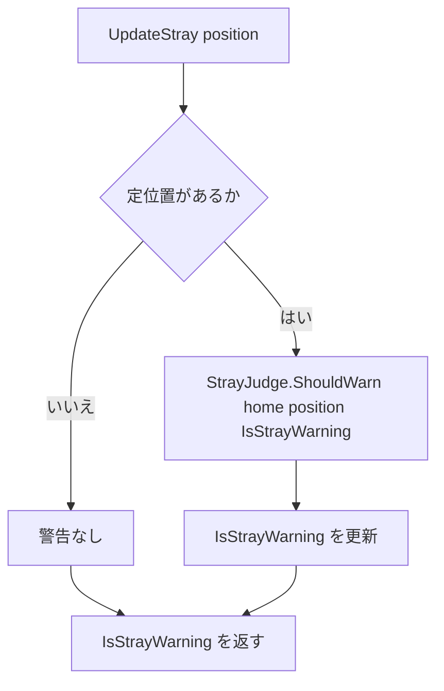

# Design Document — round-core

## Overview
**Purpose**: ラウンドの状態遷移（待機 → プレイ → 結果 → 待機）、制限時間、撃墜数とスコア、定位置と離脱判定の規則を、UnityEngine に依存しない計算として `MosquitoSpray.Core` に置く。EditMode テストだけで規則を確かめられるようにする。
**Users**: 下流の round-flow-adapter は、トリガー（開始の指示）・経過秒数・撃墜と刺されたこと・頭の位置を渡し、ラウンドの状態と離脱警告を受け取る。round-hud-adapter は、状態・残り時間・スコア・撃墜数・離脱警告を読んで表示する。開発者は、テストの結果で規則が正しいかを判断する。
**Impact**: `MosquitoSpray.Core` に名前空間 `MosquitoSpray.Core.Rounds` を加える。既存の `Spray` と `Mosquitoes` は変更しない。

点数の規則（撃墜 +1、刺され -1、0 で止める）は固定で、設定値にしない。制限時間・受付待ちの秒数・離脱判定の2つの距離は仮の初期値で、Core は既定値を持たない（requirements.md Introduction の表）。値を調整したら、コードより先に requirements.md の表とこの文書を直す。

### Goals
- 開始の指示と経過秒数を渡すと、待機 → プレイ → 結果 → 待機が規則どおりに進む
- プレイ中の撃墜・刺されたことが、撃墜数とスコアに規則どおりに反映される
- 頭の位置を渡すと、定位置からの水平距離とヒステリシスで離脱警告の有無が決まる
- 壊れた設定値と負の経過秒数を、その場で拒否する

### Non-Goals
- トリガー入力・頭の位置の取得（Adapter / XR）
- 撃墜・刺されたことの判定（mosquito-core）
- 表示（案内・残り時間・スコア・赤い縁・離脱警告・結果。round-hud-adapter）
- 設定値の保持と調整（Adapter 側の ScriptableObject）
- 蚊の出現の開始・停止をラウンドに合わせること（round-flow-adapter が `MosquitoSwarm` に指示する）
- `UnityEngine.Vector3` との変換

## Boundary Commitments

### This Spec Owns
- ラウンドの状態（待機・プレイ・結果）と、その遷移の条件（開始の指示、制限時間、受付待ちの秒数）
- 残り時間、撃墜数、スコアと、その増減の規則
- 定位置の記録と消去の時機
- 離脱判定の規則（水平距離、警告を出す距離・消す距離のヒステリシス）と、警告しているかどうかの状態
- 設定値と経過秒数の検証、不正な値の知らせ方
- 「プレイヤーの位置」の決まり：mosquito-core の顔の位置と同じ座標空間・同じ値（Y 軸が上、水平距離は XZ 平面上の距離）

### Out of Boundary
- トリガーが引かれたことの検出と、それを開始の指示に変えること（round-flow-adapter）
- 撃墜・刺されたことが起きたかの判定。round-core は1件ずつの知らせを受け取るだけで、mosquito-core を参照しない
- ラウンドの開始・終了に合わせて蚊の出現を開始・停止すること（round-flow-adapter）
- 離脱警告中にラウンドを止めること（外部設計で、警告中もラウンドは続く）
- 表示のすべて。刺されたときの赤い縁は、スコアの変化ではなく刺されたことの知らせから出す（0 点では変わらないため）。これは round-hud-adapter / round-flow-adapter の責任
- スコアの保存・ランキング、難易度の選択

### Allowed Dependencies
- `System`（例外型、`MathF`）
- `System.Numerics`（`Vector3`。spray-hit-core・mosquito-core と同じ型）
- `MosquitoSpray.Core.Spray` と `MosquitoSpray.Core.Mosquitoes` は参照しない。Core 同士は round-flow-adapter が橋渡しする
- これ以外の参照を足さない。UnityEngine は asmdef が拒否する
- テストは `MosquitoSpray.Tests.EditMode` に置き、NUnit と `MosquitoSpray.Core` だけを使う

### Revalidation Triggers
- `Round` の公開メンバー（`RequestStart` / `Advance` / `NotifyDowned` / `NotifyBitten` / `UpdateStray` と読み取りプロパティ）のシグネチャや戻り値の意味の変更 → round-flow-adapter、round-hud-adapter
- `RoundPhase` の値の追加・変更 → round-flow-adapter、round-hud-adapter
- `RoundRules` のコンストラクタ引数と受け付ける範囲の変更 → round-flow-adapter の ScriptableObject と、その検証
- プレイヤーの位置の決まり（座標空間、Y が上）の変更 → round-flow-adapter の座標変換
- 結果に入るときに定位置と警告を消す時機の変更 → round-hud-adapter の離脱警告の表示

## Architecture

### Architecture Pattern & Boundary Map



**Architecture Integration**:
- Selected pattern: 外から時間を進める状態機械。`Round` が唯一の状態を持つ公開の入口で、時計を持たない。離脱判定の式は状態を持たない `StrayJudge` に分ける
- Domain/feature boundaries:
  - `Round`：状態遷移、残り時間、受付待ち、撃墜数とスコア、定位置、警告しているかどうか
  - `StrayJudge`：直前に警告していたかと距離から、警告すべきかを返す式だけ
  - `RoundRules`：設定値の検証
- Existing patterns preserved：
  - 検証はコンストラクタに集め、`ArgumentOutOfRangeException` と `ParamName` で知らせる（spray-hit-core、mosquito-core）
  - 時間は `Advance(float deltaTime)` で渡す。負・NaN・無限大は拒否し、何も変えない（mosquito-core）
  - 位置は `System.Numerics.Vector3`、Y 軸が上（mosquito-core）
  - 境界ちょうどの比較に、公開しない許容誤差を入れる
  - 名前空間はフォルダと一致させ、型名と衝突しないよう複数形にする（`Rounds`）
- New components rationale: 下の Components の表を参照。警告フラグを `Round` に置く理由は research.md「Design Decisions」
- Steering compliance: tech.md「L1 Core」「単位」「禁止事項 1」、structure.md「`Assets/Scripts/Core/`」「調整しうる数値はコードに直書きしない」

### Technology Stack

| Layer | Choice / Version | Role in Feature | Notes |
|-------|------------------|-----------------|-------|
| Domain (L1 Core) | C# / `System.Numerics.Vector3` | 位置、水平距離 | mosquito-core と同じ。追加パッケージなし |
| Test | Unity Test Framework（NUnit） | EditMode テスト | `[Test]` と `[TestCase]` のみ。`[UnityTest]` は使わない |

## File Structure Plan

### Directory Structure
```
Assets/
├── Scripts/Core/
│   └── Rounds/                         # namespace MosquitoSpray.Core.Rounds
│       ├── RoundRules.cs               # 設定値4つの保持と検証
│       ├── RoundPhase.cs               # 待機・プレイ・結果 の列挙
│       ├── StrayJudge.cs               # 離脱判定の式（static、状態を持たない）
│       └── Round.cs                    # 公開の入口：開始の指示・時間経過・撃墜と刺されの知らせ・離脱判定の更新
└── Tests/EditMode/
    └── Rounds/                         # namespace MosquitoSpray.Tests.EditMode.Rounds
        ├── RoundRulesTests.cs          # RoundRules の生成と拒否
        ├── StrayJudgeTests.cs          # 離脱判定の式（ヒステリシス、水平距離、境界ちょうど）
        ├── RoundTests.cs               # partial：共通の準備（既定の Rules、生成ヘルパー）と、開始・時間経過・結果から待機・経過秒数の検証
        ├── RoundTests.Score.cs         # partial：撃墜数とスコア
        └── RoundTests.Stray.cs         # partial：定位置の記録と消去、UpdateStray と警告フラグ
```

`.meta` は Unity が生成する。手で作らない（tech.md 禁止事項 2）。
`RoundTests` を partial に分けるのは、ファイルが大きくなりすぎないようにするため。分けても命名規約 `<対象クラス名>Tests` は保たれる。

### Modified Files
- なし（asmdef、`Spray`、`Mosquitoes` ともに変更しない）

## System Flows

### ラウンドの状態



| 状態 | `RequestStart` | `Advance` | `NotifyDowned` / `NotifyBitten` | 定位置 |
|------|----------------|-----------|----------------------------------|--------|
| Waiting | Playing へ。定位置を記録し、警告なしから始める。`true` | 何もしない。`false` | 無視 | なし |
| Playing | 何もしない。`false` | 残り時間を減らす。0 以下で Result へ、`true` | 撃墜数とスコアに反映 | あり |
| Result | 受付待ちが経過していれば Waiting へ、`true`。そうでなければ `false` | 受付待ちの経過秒数を足す。`false` | 無視 | なし |

- Waiting → Playing と Result → Waiting は、どちらも `RequestStart` 1回で1つだけ進む。Result から Waiting に戻した同じ呼び出しでは、プレイを始めない（3.4）
- Playing → Result のとき、残り時間を 0 にし、残り時間を超えた分の秒数は捨てる（受付待ちに数えない。2.2）。撃墜数とスコアはそのまま、定位置と警告は消す（2.5, 5.6）
- Result → Waiting のとき、残り時間を制限時間に、撃墜数とスコアを 0 に戻す（3.3）

### 離脱判定（`UpdateStray`）



- 警告していないとき：水平距離 ≥ 警告を出す距離 で警告（5.1, 5.2）
- 警告しているとき：水平距離 < 警告を消す距離 で解除、それ以外は続ける（5.3, 5.4）
- `UpdateStray` は状態・残り時間・撃墜数・スコアに触れない（5.8）

## Requirements Traceability

| Requirement | Summary | Components | Interfaces | Flows |
|-------------|---------|------------|------------|-------|
| 1.1 | 最初は待機、残り時間は制限時間、0 点 | Round | コンストラクタ、`Phase` 他 | 状態 |
| 1.2 | 待機で開始の指示 → すぐプレイ、値を初期化 | Round | `RequestStart` | 状態 |
| 1.3 | 開始時の位置を定位置に記録 | Round | `RequestStart`、`HomePosition` | 状態 |
| 1.4 | プレイ中の開始の指示は無視 | Round | `RequestStart` が `false` | 状態 |
| 2.1 | プレイ中は残り時間を減らす | Round | `Advance` | 状態 |
| 2.2 | 0 以下で結果へ、超過分は捨てる | Round | `Advance` | 状態 |
| 2.3 | ちょうど同じ秒数で結果へ | Round | `Advance`（許容誤差） | 状態 |
| 2.4 | 終わったことを読み取れる | Round | `Advance` が `true` | 状態 |
| 2.5 | 結果では撃墜数・スコアを保ち、定位置を消す | Round | `HomePosition` が `null` | 状態 |
| 2.6 | 経過秒数 0 では何も変えない | Round | `Advance(0)` | — |
| 2.7 | 待機・結果では時間で値が変わらない | Round | `Advance` | 状態 |
| 3.1 | 受付待ちが経過したら待機へ | Round | `RequestStart`、`Advance` | 状態 |
| 3.2 | 受付待ちの間は結果のまま | Round | `RequestStart` が `false` | 状態 |
| 3.3 | 待機へ戻るとき値を初期化 | Round | `RequestStart` | 状態 |
| 3.4 | 待機へ戻した同じ指示ではプレイを始めない | Round | `RequestStart` | 状態 |
| 3.5 | 待機へ戻った直後の指示ですぐプレイ | Round | `RequestStart` | 状態 |
| 4.1 | 撃墜で撃墜数 +1、スコア +1 | Round | `NotifyDowned` | — |
| 4.2 | 刺されでスコア -1 | Round | `NotifyBitten` | — |
| 4.3 | 0 点で刺されても 0 | Round | `NotifyBitten` | — |
| 4.4 | 刺されで撃墜数は変わらない | Round | `NotifyBitten` | — |
| 4.5 | 待機・結果では知らせを無視 | Round | `NotifyDowned` / `NotifyBitten` | 状態 |
| 4.6 | 知らされた順に1件ずつ | Round | 呼び出しごとに即時反映 | — |
| 5.1 | 警告なし・距離 ≥ 出す距離 → 警告 | StrayJudge, Round | `ShouldWarn`、`UpdateStray` | 離脱判定 |
| 5.2 | 警告なし・距離 < 出す距離 → 警告なし | StrayJudge | `ShouldWarn` | 離脱判定 |
| 5.3 | 警告中・距離 ≥ 消す距離 → 続ける | StrayJudge | `ShouldWarn` | 離脱判定 |
| 5.4 | 警告中・距離 < 消す距離 → 消す | StrayJudge | `ShouldWarn` | 離脱判定 |
| 5.5 | 高さの差を使わない | StrayJudge | XZ 平面の距離 | — |
| 5.6 | 定位置がなければ警告しない | Round | `UpdateStray`、結果で定位置と警告を消す | 離脱判定 |
| 5.7 | 開始時は警告なしから | Round | `RequestStart` で `IsStrayWarning = false` | 状態 |
| 5.8 | 警告が状態・時間・スコアを変えない | Round | `UpdateStray` は警告フラグだけを変える | 離脱判定 |
| 6.1 | 状態・残り時間・撃墜数・スコアを読める | Round | `Phase` / `RemainingTime` / `DownedCount` / `Score` | — |
| 6.2 | 定位置の有無と値を読める | Round | `HomePosition`（`Vector3?`） | — |
| 6.3 | 開始の指示で変わったか・変わった先を読める | Round | `RequestStart` の戻り値と `Phase` | 状態 |
| 7.1 | 制限時間・2つの距離 ≤ 0 を拒否 | RoundRules | コンストラクタ | — |
| 7.2 | 受付待ち < 0 を拒否 | RoundRules | コンストラクタ | — |
| 7.3 | 消す距離 > 出す距離を拒否 | RoundRules | コンストラクタ | — |
| 7.4 | 負の経過秒数を拒否し、何も変えない | Round | `Advance` | — |
| 8.1 | シーンを起動せずに確かめられる | 全テスト | EditMode `[Test]` | — |
| 8.2 | 公開する操作すべてにテスト | 全テスト | — | — |
| 8.3 | 境界5ケースを固定 | RoundTests, StrayJudgeTests | — | — |
| 8.4 | 仮の初期値以外でも成り立つ | RoundRulesTests, RoundTests, StrayJudgeTests | — | — |

## Components and Interfaces

| Component | Domain/Layer | Intent | Req Coverage | Key Dependencies | Contracts |
|-----------|--------------|--------|--------------|------------------|-----------|
| RoundRules | Rounds / L1 Core | 設定値4つを検証して持つ | 7.1–7.3 | System (P0) | State |
| RoundPhase | Rounds / L1 Core | ラウンドの状態の列挙 | 6.1 | — | State |
| StrayJudge | Rounds / L1 Core | 離脱判定の式 | 5.1–5.5 | RoundRules (P0), System.Numerics (P0) | Service |
| Round | Rounds / L1 Core | 公開の入口。状態遷移・時間・スコア・定位置・警告フラグ | 1.1–1.4, 2.1–2.7, 3.1–3.5, 4.1–4.6, 5.1, 5.6–5.8, 6.1–6.3, 7.4 | RoundRules (P0), StrayJudge (P0) | Service, State, Event |
| RoundRulesTests / StrayJudgeTests / RoundTests | Rounds / EditMode Test | 規則と境界をテストで固定する | 8.1–8.4（と 1〜7 の検証） | NUnit (P0) | — |

### Rounds / L1 Core

#### RoundRules

| Field | Detail |
|-------|--------|
| Intent | 制限時間・受付待ちの秒数・離脱判定の2つの距離を、検証済みの状態で持つ |
| Requirements | 7.1, 7.2, 7.3 |

**Responsibilities & Constraints**
- 検証はコンストラクタだけで行う。作られた `RoundRules` は常に有効
- 不変。`sealed class` にする（`default` で検証を迂回できないように。mosquito-core と同じ理由）
- 既定値を持たない。仮の初期値はテストと Adapter の ScriptableObject が持つ
- 点数（+1 / -1）は持たない。固定の規則として `Round` が持つ

**Dependencies**
- Inbound: round-flow-adapter — ScriptableObject の値から作る (P0)
- Inbound: Round、StrayJudge — 値を読む (P0)

**Contracts**: State [x]

```csharp
namespace MosquitoSpray.Core.Rounds
{
    public sealed class RoundRules
    {
        // 検査は引数の並び順に行い、最初に見つかった不正な値で例外を投げる。範囲は「受け付ける範囲に入っていなければ拒否」で書き、NaN と無限大も拒否する
        //   ArgumentOutOfRangeException (ParamName = "timeLimit")            0 < timeLimit の有限値でない
        //   ArgumentOutOfRangeException (ParamName = "restartDelay")         0 ≤ restartDelay の有限値でない
        //   ArgumentOutOfRangeException (ParamName = "strayWarnDistance")    0 < strayWarnDistance の有限値でない
        //   ArgumentOutOfRangeException (ParamName = "strayClearDistance")   0 < strayClearDistance ≤ strayWarnDistance の有限値でない
        public RoundRules(
            float timeLimit,            // 秒。1ラウンドの制限時間
            float restartDelay,         // 秒。結果に入ってから開始の指示を受け付けない時間
            float strayWarnDistance,    // m。定位置からの水平距離がこれ以上で警告を出す
            float strayClearDistance);  // m。定位置からの水平距離がこれ未満で警告を消す

        public float TimeLimit { get; }
        public float RestartDelay { get; }
        public float StrayWarnDistance { get; }
        public float StrayClearDistance { get; }
    }
}
```
- 要件 7.3 の「離脱判定の距離が不正」は、`ParamName == "strayClearDistance"` で知らせる。7.1 の「警告を消す距離 ≤ 0」も同じ `ParamName` になる（どちらも消す距離が受け付ける範囲の外）
- 消す距離 = 出す距離は受け付ける（要件は「より大きい」ときだけを拒否している）。このときヒステリシスのない1つのしきい値になる
- 受付待ち 0 秒は受け付ける（要件は「0 より小さい」ときだけを拒否している）

#### RoundPhase

```csharp
namespace MosquitoSpray.Core.Rounds
{
    public enum RoundPhase { Waiting, Playing, Result }  // 待機・プレイ・結果
}
```

#### StrayJudge

| Field | Detail |
|-------|--------|
| Intent | 定位置・プレイヤーの位置・直前に警告していたかから、警告すべきかを返す |
| Requirements | 5.1, 5.2, 5.3, 5.4, 5.5 |

**Responsibilities & Constraints**
- 状態を持たない。同じ入力には常に同じ答えを返す
- ラウンドの状態を知らない。定位置があるかどうかの判断は `Round` が行う（5.6）

**Contracts**: Service [x]

```csharp
namespace MosquitoSpray.Core.Rounds
{
    public static class StrayJudge
    {
        // 警告すべきなら true
        // ArgumentNullException (ParamName = "rules")
        public static bool ShouldWarn(Vector3 home, Vector3 position, bool warning, RoundRules rules);
    }
}
```
- 水平距離 `d = |(position − home) を Y = 0 にしたもの|`（XZ 平面上の距離。5.5）
- `warning == false` のとき：`d ≥ StrayWarnDistance − DistanceTolerance` なら `true`、そうでなければ `false`（5.1, 5.2）
- `warning == true` のとき：`d < StrayClearDistance − DistanceTolerance` なら `false`、そうでなければ `true`（5.3, 5.4）
- 「警告を出す距離ちょうど」は警告する。「警告を消す距離ちょうど」は警告を続ける（要件の「以上」「未満」のとおり。8.3）
- `home` / `position` の値は検証しない（NaN は要件外。保証しない）

#### Round

| Field | Detail |
|-------|--------|
| Intent | 開始の指示・時間経過・撃墜と刺されの知らせ・離脱判定の更新を受け付ける唯一の公開の入口 |
| Requirements | 1.1–1.4, 2.1–2.7, 3.1–3.5, 4.1–4.6, 5.1, 5.6, 5.7, 5.8, 6.1, 6.2, 6.3, 7.4 |

**Responsibilities & Constraints**
- 時計を持たない。時間は `Advance` の `deltaTime` でだけ進む
- 状態ごとに受け付ける入力を決める（System Flows の表）
- 知らせは呼ばれた時点で1件ずつ反映し、ためておかない（4.6）
- 警告フラグは、ラウンドの状態・残り時間・撃墜数・スコアに影響しない。逆に、定位置の記録・消去に合わせてフラグを下ろす（5.6, 5.7, 5.8）

**Dependencies**
- Inbound: round-flow-adapter — `RequestStart`・`Advance`・`NotifyDowned`・`NotifyBitten`・`UpdateStray` (P0)
- Inbound: round-hud-adapter — 読み取りプロパティ (P0)
- Outbound: RoundRules、StrayJudge (P0)

**Contracts**: Service [x] / Event [x] / State [x]

```csharp
namespace MosquitoSpray.Core.Rounds
{
    public sealed class Round
    {
        // ArgumentNullException (ParamName = "rules")
        public Round(RoundRules rules);

        public RoundRules Rules { get; }
        public RoundPhase Phase { get; }          // 作った直後は Waiting
        public float RemainingTime { get; }       // 秒。Waiting では TimeLimit、Result では 0
        public int DownedCount { get; }           // 0 以上
        public int Score { get; }                 // 0 以上
        public Vector3? HomePosition { get; }     // Playing の間だけ値がある
        public bool IsStrayWarning { get; }       // Playing の間だけ true になりうる

        // 開始の指示。状態が変わったら true（変わった先は Phase）
        //   Waiting → Playing：残り時間を TimeLimit、撃墜数とスコアを 0、HomePosition = playerPosition、IsStrayWarning = false
        //   Result → Waiting：受付待ちの経過秒数 ≥ RestartDelay − TimeTolerance のときだけ。残り時間を TimeLimit、撃墜数とスコアを 0
        //   それ以外：何も変えず false
        public bool RequestStart(Vector3 playerPosition);

        // 時間を進める。この呼び出しで Playing から Result に変わったら true
        // ArgumentOutOfRangeException (ParamName = "deltaTime") 0 ≤ deltaTime の有限値でない。このとき何も変えない
        public bool Advance(float deltaTime);

        // 撃墜1件。Playing のときだけ DownedCount と Score を 1 増やす
        public void NotifyDowned();

        // 刺された1件。Playing で Score ≥ 1 のときだけ Score を 1 減らす
        public void NotifyBitten();

        // 離脱判定を更新し、更新後の IsStrayWarning を返す
        //   HomePosition がなければ IsStrayWarning = false
        //   あれば IsStrayWarning = StrayJudge.ShouldWarn(HomePosition, playerPosition, IsStrayWarning, Rules)
        public bool UpdateStray(Vector3 playerPosition);
    }
}
```

`Advance` の事後条件（検証のあと）：
- Waiting：何も変えない（2.7）
- Playing：`RemainingTime −= deltaTime`（2.1）。`RemainingTime ≤ TimeTolerance` になったら、`RemainingTime = 0`、`Phase = Result`、受付待ちの経過秒数 = 0（超過分は捨てる）、`HomePosition = null`、`IsStrayWarning = false` として `true` を返す（2.2–2.5, 5.6）
- Result：受付待ちの経過秒数に `deltaTime` を足す。残り時間・撃墜数・スコアは変えない（2.7, 3.1）
- `deltaTime = 0` のときは、どの状態でも値が変わらない（2.6）。Playing で残り時間がすでに 0 以下ということはない（その時点で Result に変わっているため）

- Preconditions: `playerPosition` の値は検証しない（NaN の位置は要件外。保証しない）
- Invariants: `0 ≤ RemainingTime ≤ TimeLimit`、`DownedCount ≥ 0`、`Score ≥ 0`、`Score ≤ DownedCount`、`HomePosition != null ⇔ Phase == Playing`、`IsStrayWarning ⇒ Phase == Playing`

##### Event Contract
- Published events: ラウンドの開始・待機への復帰（`RequestStart` の戻り値）、ラウンドの終了（`Advance` の戻り値）。C# の `event` は使わない（research.md）
- Subscribed events: 撃墜（`NotifyDowned`）、刺された（`NotifyBitten`）。どちらも1件につき1回呼ばれる前提
- Ordering / delivery guarantees: 呼ばれた順に即時反映する。0 で止めるため順番で結果が変わる（例：0 点で「刺され → 撃墜」は 1 点、「撃墜 → 刺され」は 0 点）。これは要件 4.6 のとおり

##### State Management
- State model: `Phase`、`RemainingTime`、`DownedCount`、`Score`、`HomePosition`、`IsStrayWarning`、受付待ちの経過秒数（非公開）
- Concurrency strategy: スレッドセーフではない。Adapter は1つのスレッド（Unity のメインスレッド）から呼ぶ

**Implementation Notes**
- Integration: round-flow-adapter は、頭の位置を1回取得し、`MosquitoSwarm.Advance` の顔の位置と `Round.UpdateStray` の両方に同じ値を渡す。トリガーが引かれた瞬間に `RequestStart(頭の位置)` を呼び、`true` で `Phase == Playing` なら `MosquitoSwarm.Start()` を呼ぶ。毎フレーム `Round.Advance(deltaTime)` を先に呼び、`true` なら `MosquitoSwarm.Stop()` を呼ぶ。Playing の間だけ `MosquitoSwarm.Advance` を呼び、`TryHit` が `true` を返すたびに `NotifyDowned()`、`AdvanceResult.Bitten` の要素1つごとに `NotifyBitten()` を呼ぶ。この順は推奨で、round-core は順が違っても Result の間の知らせを無視するのでスコアは壊れない
- Validation: 許容誤差は `TimeTolerance = 1e-5f`（秒）、`DistanceTolerance = 1e-5f`（m）。どちらも `private const` にし、公開しない（mosquito-core と同じ値）
- Risks: 毎フレームの経過秒数を60秒ぶん引くと、float の誤差が許容誤差を超え、終わる時刻が1フレームずれることがある。体験には影響しない

## Error Handling

### Error Strategy
不正な設定値と経過秒数は、例外にしてその場で止める（Fail Fast）。どちらも設定ミスかバグのときにしか来ず、ゲーム中の通常の経路にはない。
状態に合わない入力（プレイ中の開始の指示、受付待ち中の開始の指示、待機・結果中の撃墜と刺されの知らせ）は、例外にせず無視する。トリガーはいつでも引かれうるし、蚊の知らせはフレームの境目で結果の状態に届きうるため、通常の経路にある。

### Error Categories and Responses

| 状況 | 例外 | ParamName | 要件 |
|------|------|-----------|------|
| 制限時間が 0 以下（NaN・無限大を含む） | `ArgumentOutOfRangeException` | `timeLimit` | 7.1 |
| 受付待ちの秒数が負（NaN・無限大を含む） | `ArgumentOutOfRangeException` | `restartDelay` | 7.2 |
| 警告を出す距離が 0 以下（NaN・無限大を含む） | `ArgumentOutOfRangeException` | `strayWarnDistance` | 7.1 |
| 警告を消す距離が 0 以下、または出す距離より大きい（NaN・無限大を含む） | `ArgumentOutOfRangeException` | `strayClearDistance` | 7.1, 7.3 |
| 経過秒数が負（NaN・無限大を含む） | `ArgumentOutOfRangeException` | `deltaTime` | 7.4 |
| `rules` が null | `ArgumentNullException` | `rules` | — |

### Monitoring
Core はログを出さない。例外のログ出力は、呼び出し側（Adapter）の責任。

## Testing Strategy

すべて `[Test]` / `[TestCase]`。定位置とプレイヤーの位置は原点以外（例 `(0.5, 1.2, -0.3)`）を使い、定位置を差し引き忘れる誤りを検出する。
仮の初期値の Rules（60秒、1.0秒、0.5m、0.4m）を `RoundTests` の共通の準備に置く。時間を細かく刻むときは 1/64 秒（float で誤差なく表せる）を使う。
許容誤差は、境界からその内側にずれた値（59.999996 秒、0.999995 秒、0.499995m、0.399995m）のテストで固定する。ちょうどの値のテストだけでは、許容誤差を消しても落ちないため（mosquito-core で 0.300005m のテストを足したのと同じ理由）。
仮の初期値以外の Rules として、`(10秒, 0秒, 1.0m, 1.0m)`（受付待ち 0、消す距離 = 出す距離）と `(2.5秒, 0.25秒, 0.75m, 0.25m)` を使う（8.4）。

### RoundRulesTests（7.1–7.3, 8.4）
- 仮の初期値で作ると、4つのプロパティが渡した値と等しい
- 仮の初期値以外の組で作れる。受付待ち 0 秒と、消す距離 = 出す距離も受け付ける
- `timeLimit` / `strayWarnDistance` / `strayClearDistance` が `0 / -1 / NaN / +∞` → 各 `ParamName`（7.1）
- `restartDelay` が `-0.1 / NaN / +∞` → `restartDelay`（7.2）
- `strayClearDistance = 0.6`、`strayWarnDistance = 0.5` → `strayClearDistance`（7.3）

### StrayJudgeTests（5.1–5.5, 8.3, 8.4）
- 警告なし：水平距離 0.49m → `false`、0.5m ちょうど → `true`、0.8m → `true`（5.1, 5.2, 8.3「警告を出す距離ちょうど」）
- 警告中：0.45m → `true`、0.4m ちょうど → `true`、0.39m → `false`（5.3, 5.4, 8.3「警告を消す距離ちょうど」）
- 警告なしで 0.45m → `false`、警告中で 0.45m → `true`（同じ距離で直前の警告によって答えが変わる。ヒステリシス）
- 定位置の真上・真下に 1.0m 離れた位置（水平距離 0）は、警告なしでも警告中でも `false`。水平 0.3m・高さ 2.0m の差でも、警告なしなら `false`（5.5）
- 水平の差を X だけ・Z だけ・斜め（0.3, 0.4 → 0.5m）で与えても同じ距離として扱う（5.5）
- 消す距離 = 出す距離（1.0m）の Rules で、警告なしは 1.0m で `true`、警告中は 1.0m で `true`・0.99m で `false`（8.4）
- `rules == null` → `ArgumentNullException`

### 開始・時間経過・結果から待機（RoundTests.cs。1.1–1.4, 2.1–2.7, 3.1–3.5, 6.1–6.3, 7.4）
- 作った直後は `Phase == Waiting`、`RemainingTime == 60`、`DownedCount == 0`、`Score == 0`、`HomePosition == null`（1.1, 6.1, 6.2）
- 待機で `RequestStart(p)` → `true`、`Phase == Playing`、`RemainingTime == 60`、`HomePosition == p`（`Advance` を呼ばずに。1.2, 1.3, 6.3）
- プレイ中に撃墜を2件知らせてから `RequestStart(q)` → `false`。状態・残り時間・撃墜数・スコア・定位置（`p` のまま）が変わらない（1.4）
- プレイ中に `Advance(1/64)` を64回 → `RemainingTime == 59`（2.1）
- 残り 60 秒で `Advance(60)` → `true`、`Phase == Result`、`RemainingTime == 0`（2.3, 2.4, 8.3「残り時間ちょうど 0」）。`Advance(59.99)` では `false` で Playing のまま
- 残り 60 秒で `Advance(61)` → `true`、`RemainingTime == 0`。続けて `RequestStart` → `false`（超えた 1 秒を受付待ちに数えない。2.2）
- 撃墜3件・刺され1件のあとで結果に入ると、`DownedCount == 3`、`Score == 2` のまま、`HomePosition == null`（2.5）
- 結果に入った `Advance` 以外で `true` を返さない：結果で `Advance(5)` → `false`（2.4）
- `Advance(0)` は待機・プレイ・結果のどれでも値を変えない（2.6）
- 待機で `Advance(100)` → 残り時間・撃墜数・スコアが変わらず、Playing にもならない。結果で `Advance(100)` → 残り時間 0、撃墜数・スコアが変わらない（2.7）
- 結果に入ってから `Advance(0.5)` を2回 → `RequestStart` が `true`、`Phase == Waiting`（3.1, 8.3「受付待ちちょうど」）。`Advance(63/64)` だけなら `RequestStart` は `false` で Result のまま、撃墜数・スコアも変わらない（3.2）
- 待機に戻ると `RemainingTime == 60`、`DownedCount == 0`、`Score == 0`（3.3）
- 待機に戻した `RequestStart` の直後、`Phase == Waiting` のまま（同じ呼び出しでプレイにならない。3.4）。続けて `Advance` を呼ばずに `RequestStart` → `true`、`Phase == Playing`（3.5）
- 受付待ち 0 秒の Rules では、結果に入った直後の `RequestStart` で待機に戻る（8.4）
- 制限時間 2.5 秒の Rules で、`Advance(2.5)` で結果に入る（8.4）
- `Advance(-0.1 / NaN / +∞)` → `ArgumentOutOfRangeException`、`ParamName == "deltaTime"`。待機・プレイ・結果のどれでも、呼ぶ前と値が同じ（7.4）
- `new Round(null)` → `ArgumentNullException`

### 撃墜数とスコア（RoundTests.Score.cs。4.1–4.6, 8.3）
- プレイ中に `NotifyDowned` を3回 → `DownedCount == 3`、`Score == 3`（4.1）
- 撃墜3件のあと `NotifyBitten` を1回 → `Score == 2`、`DownedCount == 3`（4.2, 4.4）
- 0 点で `NotifyBitten` → `Score == 0`（4.3, 8.3「0 点で刺される」）
- 撃墜1件のあと `NotifyBitten` を3回 → `Score == 0`、`DownedCount == 1`（4.3, 4.4）
- 待機と結果で `NotifyDowned` / `NotifyBitten` → 撃墜数・スコアが変わらない（4.5）
- 0 点から「刺され → 撃墜」で `Score == 1`、「撃墜 → 刺され」で `Score == 0`（4.6）

### 定位置と離脱警告（RoundTests.Stray.cs。5.1, 5.6–5.8）
- 待機で `UpdateStray(遠い位置)` → `false`、`IsStrayWarning == false`（5.6）
- プレイ中、定位置から水平 0.6m で `UpdateStray` → `true`。0.45m に戻しても `true`、0.3m で `false`（5.1, 5.3, 5.4 を `Round` 経由で）
- 警告中に結果に入ると `IsStrayWarning == false`。結果で `UpdateStray(遠い位置)` → `false`（5.6）
- 警告中のまま結果 → 待機 → 次のラウンドを始めると `IsStrayWarning == false`。次のラウンドの定位置は新しい `RequestStart` の位置（1.3, 5.7）
- 警告中に `Advance` すると、警告なしと同じだけ残り時間が減る。警告中の `NotifyDowned` / `NotifyBitten` も警告なしと同じに反映される。`UpdateStray` の前後で `Phase`・`RemainingTime`・`DownedCount`・`Score` が変わらない（5.8）

### 実行（8.1, 8.2）
- 公開メンバー（`RoundRules` のコンストラクタと4つのプロパティ、`StrayJudge.ShouldWarn`、`Round` のコンストラクタ・`Rules`・`Phase`・`RemainingTime`・`DownedCount`・`Score`・`HomePosition`・`IsStrayWarning`・`RequestStart`・`Advance`・`NotifyDowned`・`NotifyBitten`・`UpdateStray`）のどれにも、少なくとも1本のテストがある（8.2）
- Stop フック（EditMode）で全件が通ることを完了条件にする（8.1）
