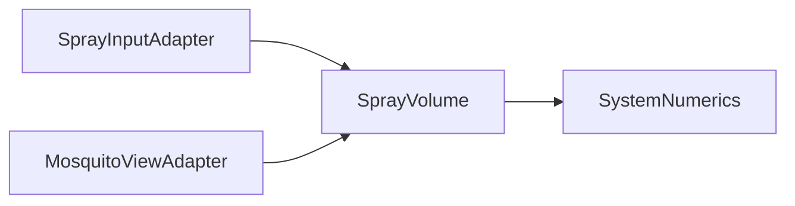
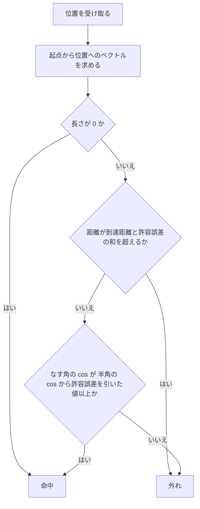

# Design Document — spray-hit-core

## Overview
**Purpose**: 噴射が蚊に当たったかどうかを決める規則を、UnityEngine に依存しない純粋な計算として `MosquitoSpray.Core` に置く。EditMode テストだけで規則を確かめられるようにする。
**Users**: 下流の spray-input-adapter が噴射範囲（SprayVolume）を作り、mosquito-view-adapter が蚊の位置を判定にかける。開発者はテストの結果で規則の正しさを判断する。
**Impact**: 空の `MosquitoSpray.Core` に、最初のドメイン型 `SprayVolume` を加える。

噴射範囲は、起点から向きの方向に伸びる円錐で、半角と到達距離で形が決まる。仮の初期値は **半角 15°・到達距離 1.0m**。シミュレータで調整する前提であり、Core はこの値を持たない（要件 1.4）。値を調整したら、この節と requirements.md の Introduction を先に直す。

### Goals
- 起点・向き・半角・到達距離から噴射範囲を作り、ある位置が命中かを判定できる
- 壊れた形の噴射範囲は作れない
- 境界の4ケース（角度ちょうど・距離ちょうど・真後ろ・起点と同じ位置）の結果がテストで決まっている

### Non-Goals
- 半角・到達距離の値を保持・調整する仕組み（Adapter 側の ScriptableObject。spray-input-adapter の範囲）
- 噴射のタイミング、連射、見た目
- 命中した蚊の状態変更（撃墜）
- `UnityEngine.Vector3` との変換（Adapter の範囲）

## Boundary Commitments

### This Spec Owns
- 噴射範囲の形の表現（起点・向き・半角・到達距離）と、その不変条件（壊れた形は存在しない）
- 「ある位置が噴射範囲に入るか」の判定規則と、境界での扱い（許容誤差を含む）
- 不正な形を拒否するときの知らせ方（どの例外を、どの引数名で投げるか）

### Out of Boundary
- 噴射を出すかどうかの判断。トラッキングが外れて向きが取れないときに噴射しないのは呼び出し側（spray-input-adapter）の責任
- 判定の対象を選ぶこと（どの蚊を判定にかけるか）と、判定結果の扱い（mosquito-view-adapter / mosquito-core）
- 半角・到達距離の既定値を持つこと。Core に定数として置かない
- Collider・Physics・Raycast による判定

### Allowed Dependencies
- `System`（例外型、`MathF`）
- `System.Numerics`（`Vector3`）
- これ以外の参照を `MosquitoSpray.Core` に足さない。UnityEngine は asmdef が拒否する
- テストは `MosquitoSpray.Tests.EditMode` に置き、NUnit と `MosquitoSpray.Core` のみを使う

### Revalidation Triggers
- `SprayVolume` のコンストラクタ引数・公開プロパティ・`Contains` のシグネチャの変更 → spray-input-adapter / mosquito-view-adapter
- 位置の型（`System.Numerics.Vector3`）の変更 → mosquito-core と全 Adapter
- 境界の扱い（境界を含む／含まない、許容誤差、起点と同じ位置）の変更 → mosquito-view-adapter のテスト
- 受け付ける半角・到達距離の範囲の変更 → spray-input-adapter の設定値の検証

## Architecture

### Architecture Pattern & Boundary Map
コンポーネントは `SprayVolume` 1つなので、構造図は省く。依存の向きは steering のとおり **Core ← Adapter ← XR**。



**Architecture Integration**:
- Selected pattern: 不変の値オブジェクト。形の検証をコンストラクタに集め、作られた値は常に有効
- Domain/feature boundaries: 形と判定を1つの型にまとめる。判定は1種類しかなく、分けると実装1つの間接層になるため（research.md「Architecture Pattern Evaluation」）
- Existing patterns preserved: `noEngineReferences: true`、単位はメートルと度、変数名に単位を入れない
- Steering compliance: tech.md「L1 Core」「禁止事項 1」、structure.md「`Assets/Scripts/Core/`」

### Technology Stack

| Layer | Choice / Version | Role in Feature | Notes |
|-------|------------------|-----------------|-------|
| Domain (L1 Core) | C# / `System.Numerics.Vector3` | 位置と向きの表現、内積・長さ・正規化 | Unity の API 互換レベル（.NET Standard 系）に含まれる。追加パッケージなし |
| Test | Unity Test Framework（NUnit） | EditMode テスト | `[Test]` と `[TestCase]` のみ。`[UnityTest]` は使わない |

## File Structure Plan

### Directory Structure
```
Assets/
├── Scripts/Core/
│   └── Spray/
│       └── SprayVolume.cs          # 噴射範囲の形・検証・命中判定（namespace MosquitoSpray.Core.Spray）
└── Tests/EditMode/
    └── Spray/
        └── SprayVolumeTests.cs     # SprayVolume の全公開メンバーのテスト（namespace MosquitoSpray.Tests.EditMode.Spray）
```

`.meta` は Unity が生成する。手で作らない（tech.md 禁止事項 2）。

### Modified Files
- なし（asmdef は変更しない）

## Requirements Traceability

| Requirement | Summary | Components | Interfaces | Flows |
|-------------|---------|------------|------------|-------|
| 1.1 | 正しい値で噴射範囲を作る | SprayVolume | コンストラクタ | — |
| 1.2 | 起点・半角・到達距離を読み出せる | SprayVolume | `Origin` / `HalfAngle` / `Reach` | — |
| 1.3 | 向きの長さを無視する | SprayVolume | コンストラクタ、`Direction` | — |
| 1.4 | 値を固定せず範囲内の任意の値を受け付ける | SprayVolume | コンストラクタ | — |
| 2.1 | 距離 ≤ 到達距離 かつ 角 ≤ 半角 なら命中 | SprayVolume | `Contains` | 判定の流れ |
| 2.2 | 到達距離より遠いと外れ | SprayVolume | `Contains` | 判定の流れ |
| 2.3 | 半角より外だと外れ | SprayVolume | `Contains` | 判定の流れ |
| 2.4 | 角度ちょうどは命中 | SprayVolume | `Contains`（許容誤差） | 判定の流れ |
| 2.5 | 距離ちょうどは命中 | SprayVolume | `Contains`（許容誤差） | 判定の流れ |
| 2.6 | 真後ろは外れ | SprayVolume | `Contains` | 判定の流れ |
| 2.7 | 起点と同じ位置は命中 | SprayVolume | `Contains` | 判定の流れ |
| 2.8 | 繰り返しても同じ結果、値は変わらない | SprayVolume | 不変プロパティ、副作用のない `Contains` | — |
| 3.1 | 向きの長さ 0 を拒否 | SprayVolume | コンストラクタ → `ArgumentException("direction")` | — |
| 3.2 | 半角 ≤ 0° を拒否 | SprayVolume | コンストラクタ → `ArgumentOutOfRangeException("halfAngle")` | — |
| 3.3 | 半角 ≥ 90° を拒否 | SprayVolume | コンストラクタ → `ArgumentOutOfRangeException("halfAngle")` | — |
| 3.4 | 到達距離 ≤ 0m を拒否 | SprayVolume | コンストラクタ → `ArgumentOutOfRangeException("reach")` | — |
| 4.1 | シーンを起動せずに確かめられる | SprayVolumeTests | EditMode `[Test]` | — |
| 4.2 | 公開する操作すべてにテスト | SprayVolumeTests | — | — |
| 4.3 | 境界4ケースをテストで固定 | SprayVolumeTests | — | — |
| 4.4 | 仮の初期値以外の組でも成り立つ | SprayVolumeTests | — | — |

## System Flows

判定の流れ（`Contains`）。分岐の順序が境界の扱いを決めるため図にする。



- 起点と同じ位置は、角度を計算する前に命中とする（2.7）。方向が決まらず、0 で割ることになるため
- 真後ろ（2.6）は cos(なす角) = −1 で、半角 < 90° なら cos(半角) > 0 なので必ず外れになる。特別扱いはしない

## Components and Interfaces

| Component | Domain/Layer | Intent | Req Coverage | Key Dependencies | Contracts |
|-----------|--------------|--------|--------------|------------------|-----------|
| SprayVolume | Spray / L1 Core | 噴射範囲の形を持ち、位置が命中かを判定する | 1.1–1.4, 2.1–2.8, 3.1–3.4 | System.Numerics (P0) | Service, State |
| SprayVolumeTests | Spray / EditMode Test | SprayVolume の規則と境界をテストで固定する | 4.1–4.4（と 1〜3 の検証） | SprayVolume (P0), NUnit (P0) | — |

### Spray / L1 Core

#### SprayVolume

| Field | Detail |
|-------|--------|
| Intent | 起点から向きの方向に伸びる円錐の形を持ち、位置が命中かを判定する |
| Requirements | 1.1, 1.2, 1.3, 1.4, 2.1, 2.2, 2.3, 2.4, 2.5, 2.6, 2.7, 2.8, 3.1, 3.2, 3.3, 3.4 |

**Responsibilities & Constraints**
- 形の検証をコンストラクタだけで行う。作られた `SprayVolume` は常に有効
- 不変。生成後に値を変える手段を持たない
- `sealed class` にする。struct にすると `default` で検証を通らない値が作れてしまうため
- 半角・到達距離の既定値を持たない

**Dependencies**
- Inbound: spray-input-adapter — コントローラーの位置と向き、設定値から噴射範囲を作る (P0)
- Inbound: mosquito-view-adapter — 蚊の位置を `Contains` にかける (P0)
- External: `System.Numerics.Vector3` — 位置・向き・内積・正規化 (P0)

**Contracts**: Service [x] / API [ ] / Event [ ] / Batch [ ] / State [x]

##### Service Interface
```csharp
namespace MosquitoSpray.Core.Spray
{
    public sealed class SprayVolume
    {
        // 例外:
        //   ArgumentException            (ParamName = "direction") 向きを単位ベクトルにできない（長さ 0、NaN、無限大）
        //   ArgumentOutOfRangeException  (ParamName = "halfAngle") 0 < halfAngle < 90 でない（NaN を含む）
        //   ArgumentOutOfRangeException  (ParamName = "reach")     0 < reach でない（NaN を含む）
        public SprayVolume(Vector3 origin, Vector3 direction, float halfAngle, float reach);

        public Vector3 Origin { get; }     // 受け取った値そのまま
        public Vector3 Direction { get; }  // 正規化した単位ベクトル
        public float HalfAngle { get; }    // 度。受け取った値そのまま
        public float Reach { get; }        // メートル。受け取った値そのまま

        // 位置が噴射範囲に入っていれば true（命中）。副作用なし
        public bool Contains(Vector3 position);
    }
}
```
- Preconditions（コンストラクタ）: なし。不正な値は例外で知らせる。検査の順は `direction` → `halfAngle` → `reach`
- Preconditions（`Contains`）: なし。位置が NaN を含むときは比較がすべて偽になり `false` を返す（要件外。保証はしない）
- Postconditions（`Contains`）: 次の両方を満たすとき、またその場合に限り `true`
  - `|position − Origin| ≤ Reach + DistanceTolerance`
  - `|position − Origin| = 0`、または `dot(Direction, (position − Origin) / |position − Origin|) ≥ cos(HalfAngle) − CosTolerance`
- Invariants: `|Direction| ≈ 1`、`0 < HalfAngle < 90`、`0 < Reach`。インスタンスの値は生成後に変わらない

##### State Management
- State model: 4つの読み取り専用値。`cos(HalfAngle)` は生成時に1回だけ計算して持ってよい（外から見えない）
- Concurrency strategy: 不変なので、複数のスレッドから同時に `Contains` を呼んでよい

**Implementation Notes**
- Integration: Adapter では `UnityEngine.Vector3` と名前が衝突する。`using NVector3 = System.Numerics.Vector3;` のように別名で受け、成分を写して変換する（変換は Adapter の範囲）
- Validation: 許容誤差は `DistanceTolerance = 1e-5f`（m）、`CosTolerance = 1e-6f`。どちらも `private const` にし、公開しない
- Risks: 許容誤差を大きくしすぎると「わずかに外」のテストが命中になる。テストの「わずかに外」は 1mm・0.01° 以上離す

## Error Handling

### Error Strategy
不正な形はコンストラクタで例外にして、その場で止める（Fail Fast）。不正な値が来るのは設定ミスかバグのときだけで、ゲーム中の通常の経路にはない。`Contains` は例外を投げない。

### Error Categories and Responses

| 状況 | 例外 | ParamName | 要件 |
|------|------|-----------|------|
| 向きの長さが 0（NaN・無限大を含む） | `ArgumentException` | `direction` | 3.1 |
| 半角 ≤ 0° または ≥ 90°（NaN を含む） | `ArgumentOutOfRangeException` | `halfAngle` | 3.2, 3.3, 1.4 |
| 到達距離 ≤ 0m（NaN を含む） | `ArgumentOutOfRangeException` | `reach` | 3.4, 1.4 |

範囲の検査は「受け付ける範囲に入っていなければ拒否」の形で書く。こうすると NaN も拒否される。

### Monitoring
Core はログを出さない。例外のログ出力は呼び出し側（Adapter）の責任。

## Testing Strategy

`Assets/Tests/EditMode/Spray/SprayVolumeTests.cs`。すべて `[Test]` / `[TestCase]`。起点は原点以外（例 `(1, 1.5, -2)`）も使い、起点を差し引き忘れる誤りを検出する。

### 生成と読み出し（1.1–1.4, 3.1–3.4）
- 正しい値で作ると、`Origin`・`HalfAngle`・`Reach` が渡した値と等しい（1.1, 1.2）
- 向きに `(0, 0, 5)` を渡すと `Direction` は `(0, 0, 1)` になり、`(0, 0, 1)` で作った噴射範囲と同じ位置で同じ判定になる（1.3）
- 半角 `0.1° / 45° / 89.9°`、到達距離 `0.01m / 3m` で作れる（1.4）
- 向き `(0, 0, 0)` → `ArgumentException`、`ParamName == "direction"`（3.1）
- 半角 `0 / -10` → `ArgumentOutOfRangeException`、`ParamName == "halfAngle"`（3.2）
- 半角 `90 / 120 / NaN` → 同上（3.3, 1.4）
- 到達距離 `0 / -1 / NaN` → `ArgumentOutOfRangeException`、`ParamName == "reach"`（3.4, 1.4）

### 命中の判定（2.1–2.8）。仮の初期値 15°・1.0m で行う
- 正面 0.5m は命中。中心軸から 10°・0.5m も命中（2.1）
- 正面 1.001m は外れ（2.2）
- 中心軸から 15.01°・0.5m は外れ。真横（90°）・0.5m も外れ（2.3）
- 中心軸から ちょうど 15°・0.5m は命中（2.4）
- 正面 ちょうど 1.0m は命中（2.5）。ちょうど 15°・ちょうど 1.0m の角も命中（2.4, 2.5）
- 真後ろ 0.5m と 0.01m は外れ（2.6）
- 起点そのものは命中（2.7）
- 同じ位置で `Contains` を2回呼ぶと同じ結果で、`Origin`・`Direction`・`HalfAngle`・`Reach` は変わらない（2.8）

### 仮の初期値以外の組（4.4）
- 半角 30°・到達距離 2.0m：25°・1.9m は命中、35°・1.0m は外れ、0°・2.1m は外れ
- 半角 5°・到達距離 0.3m：正面 0.29m は命中、6°・0.2m は外れ

### 境界の固定（4.3）と実行（4.1, 4.2）
- 角度ちょうど・距離ちょうど・真後ろ・起点と同じ位置は、上の 2.4 / 2.5 / 2.6 / 2.7 のテストで固定する
- 公開メンバー（コンストラクタ、4つのプロパティ、`Contains`）のどれにも、少なくとも1本のテストがある（4.2）
- Stop フック（EditMode）で全件が通ることを完了条件にする（4.1）

テストで角度を指定した位置を作るときは、中心軸を含む平面上で `(sin θ, 0, cos θ) × 距離` のように作る。補助メソッドはテストクラス内の private に置く。
