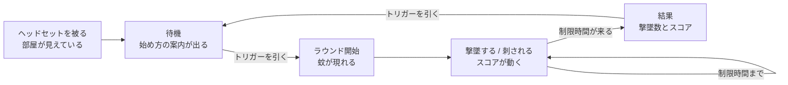

> **これは AI が書いた下書きです。**
> ガイドライン第1章の鉄則3「外部設計が先、design.md は後」と、ロードマップ 3-1
> 「外部設計は人間が書く」に従い、**spec に入る前に自分の言葉で書き直してください。**
> 書き直しが終わったら、この引用ブロックごと削除します。
>
> 書き直すときに守ること（ガイドライン第11章）:
> - 顧客向けにパラメータを書かない（「半角15°」ではなく「手を伸ばした先に届く範囲」）
> - 図とスクリーンショットを主にする。文章は補助
> - 用語は `.kiro/steering/product.md` の用語集と揃える
> - **06 は必ず埋める。**受託で最も揉めるのは「入っていると思っていた」

# 外部設計：スプレーで蚊を撃退するゲーム

版: draft-0 ／ 作成日: 2026-09-21

---

## 01. 概要

自分の部屋にいながら遊べる、ミックスリアリティのカジュアルゲーム。

ヘッドセットを被ると、目の前にはいつもの自分の部屋がそのまま見えている。そこに蚊が飛び込んでくる。
プレイヤーは手に持ったスプレーを構え、飛び回る蚊に向けて噴射して撃墜する。
制限時間のあいだに何匹撃墜できたかを競う。

蚊は放っておくと顔に近づいてくる。近くにとどまられると刺されてしまい、スコアが下がる。
「撃墜を狙う」と「顔に近づけさせない」のどちらを優先するかが、プレイ中の判断になる。

| 項目 | 内容 |
| --- | --- |
| 対象ユーザー | ミックスリアリティのゲームを初めて遊ぶ人 |
| 利用シーン | 自宅の部屋で、数分の空き時間に1ラウンド遊ぶ |
| 前提機材 | Meta Quest 3 系のヘッドセットと、両手のコントローラー |
| 姿勢 | 座ったままでも、立ったままでも遊べる。歩き回る必要はない |
| プレイ人数 | 1人 |

## 02. 体験の流れ

画面は切り替わらない。待機・プレイ・結果のすべてが、同じ部屋の中で表示の出し入れだけで進む。

## 03. 画面と空間

<!-- 書き直すときに、シミュレータのスクリーンショットに差し替える -->

| 場面 | 見えるもの |
| --- | --- |
| 待機 | 自分の部屋。始め方の案内が正面に浮かぶ。蚊はいない |
| プレイ中 | 自分の部屋。蚊が数匹飛んでいる。残り時間とスコアが視界の下のほうに出る |
| 刺されたとき | 画面の周辺が一瞬赤くなり、スコアが下がったことが分かる |
| 結果 | 部屋はそのまま。撃墜数とスコアが正面にまとまって出る |

表示は常に部屋の中に浮かんでいる。視界に貼り付いて動かない表示は使わない。

## 04. 操作方法

| やりたいこと | 操作 |
| --- | --- |
| スプレーを噴射する | 右手のコントローラーのトリガーを引く |
| 狙いをつける | 右手を蚊に向ける。噴射はコントローラーの向いた先に出る |
| ラウンドを始める／もう一度遊ぶ | 案内が出ているときにトリガーを引く |

- 使うボタンはトリガーだけ。他のボタンは使わない
- 噴射は、手を伸ばした先の届く範囲にしか当たらない。部屋の反対側の蚊には届かない
- 左手のコントローラーは持っているだけでよい
- 移動操作はない。自分の身体を動かして向きを変える

## 05. 非機能

| 項目 | 内容 |
| --- | --- |
| 動作環境 | Meta Quest 3 系 |
| 描画 | パススルーで自分の部屋が見えた状態を保つ |
| なめらかさ | 操作中に引っかかりを感じない程度のフレームレートを保つ |
| 安全 | プレイヤーが歩き回る必要がない。蚊は手の届く範囲より外にも出るが、追いかける必要はない |
| 快適さ | 視点が勝手に動く演出は使わない。酔いの原因になるため |
| 連続使用 | 1ラウンドは数分。長時間の連続使用は想定しない |
| 音 | 音がなくても遊べる状態を保つ |

## 06. 対応範囲と対象外

### 対応する

- パススルーで自分の部屋が見えた状態でのプレイ
- 右手コントローラーのトリガーによる噴射
- 蚊の出現・飛行・撃墜
- 刺されたことによる減点
- 制限時間つきの1ラウンドと、結果の表示
- Meta XR Simulator での動作

### 対象外（やらない）

ここに書いていないものは作らない。追加したくなったら、この文書を直して合意し直す。

| 対象外 | 補足 |
| --- | --- |
| **実機での動作確認** | シミュレータのみ。フレームレート、パススルー下での実際の見え方、酔いは確認しない |
| ハンドトラッキング | 入力はコントローラーのトリガーのみ |
| 複数人でのプレイ | 1人専用 |
| 部屋の形の認識 | 家具や壁との当たり判定は扱わない。蚊は家具をすり抜ける |
| 難易度の選択 | ラウンドの条件は1種類 |
| スコアの保存・記録 | 電源を切ると消える。ランキングもない |
| 音・エフェクト・3Dモデルの作り込み | 遊べる最低限にとどめる |
| 日本語以外の表示 | 日本語のみ |
| ストア公開 | 配布はしない |
