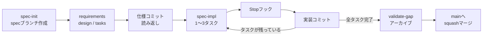

# Unity × Meta Quest 学習ロードマップ

最終更新: 2026-09-21

Step 0〜3の4段階で進める。環境準備 → Unityの復習 → Quest開発の基礎 → ガイドラインに沿ったハンズオン。最後は実機なしで、シミュレータだけで「スプレーで蚊を撃退するゲーム」を作る。

## 全体像

| Step | 内容 | 到達目標 | 所要目安 |
| --- | --- | --- | --- |
| 0 | 開発環境 | Claude Codeから公式プラグイン経由でEditorを操作できる | 半日 |
| 1 | Unityの復習 | Unity 6のEditor操作、C#スクリプト、Prefab、物理、UIを思い出す | 半日〜1日 |
| 2 | Quest開発の基礎 | Meta XR SDKでプロジェクトを作り、シミュレータでパススルーと入力を動かせる | 1〜2日 |
| 3 | ハンズオン | ガイドラインの流れ（spec→仕様コミット→実装→ゲート）を1周し、蚊撃退ゲームをシミュレータで遊べる状態にする | 3〜5日 |

**Step 3が本番。** Step 1・2は「Step 3で詰まらない最低限」に留め、全部見終えることを目的にしない。分からないところはStep 3の途中で戻ればよい。

---

## Step 0. 開発環境

Step 1以降は、Claude Codeと公式UnityプラグインでUnityを操作しながら進める。

| # | やること | 補足 |
| --- | --- | --- |
| 1 | Unity HubとUnity 6（Android Build Support付き）を入れる | バージョンはガイドライン第4章に合わせて固定する |
| 2 | VS Codeに、Claude Codeの公式拡張とUnity拡張を入れる | 難しいデバッグのときだけVisual Studioを併用してよい |
| 3 | Claude Codeに[公式Unityプラグイン](https://docs.unity.com/en-us/ai/unity-plugin/claude-code)を入れる | スキル、Unity CLI、MCPサーバーがまとめて入る |
| 4 | `unity auth login` でサインインし、`unity doctor` で環境を確認する | |
| 5 | 練習用に空のUnity 6プロジェクトを作る | 3Dテンプレートでよい |
| 6 | そのプロジェクトで `unity pipeline install` を実行する | Unity Pipelineパッケージが入り、CLIから起動中のEditorを操作できるようになる |

Unity CLIはbeta、Unity Pipelineパッケージは実験版で、手順やコマンドが変わることがある。合わないときは[Unity CLIのドキュメント](https://docs.unity.com/en-us/unity-cli)を優先する。仕組みの全体像は[Unity公式の紹介動画](https://www.youtube.com/watch?v=DgNrgZeJOxQ)（英語）で先に見ておくとよい。

### 次へ進む目安

- [ ] Claude Codeに「Cubeを3つ円形に並べて」と頼み、Editorに反映された
- [ ] Claude Codeにコンソールのログを読ませ、内容を説明させられた

---

## Step 1. Unityの復習

Step 3で使う機能だけを思い出す。上から順に見る。

| # | 教材 | 見どころ |
| --- | --- | --- |
| 1 | [たなべ「ついにUnity6が正式リリース！初心者向けに変更点や新機能を解説します」](https://www.youtube.com/watch?v=rUCgDNZRH4I) | 久しぶりに触る人向け。Unity 6での変更点をつかむ |
| 2 | [GMTK「The Unity Tutorial For Complete Beginners」](https://www.youtube.com/watch?v=XtQMytORBmM)（英語） | 約47分で物理、オブジェクト生成、ゲームロジック、UI、ゲームオーバーまで。2Dのゲームだが、生成・当たり判定・スコア・ゲームオーバーの流れは蚊撃退ゲームと同じ |
| 3 | [初心者向けUnity6でシンプルな3Dアクションゲームを作るチュートリアル](https://www.youtube.com/watch?v=IMT9FAekmpk) | Unity 6の3D操作を日本語で確認する |
| 4 | [うひやま「Unity Test Framework入門」](https://uhiyama-lab.com/ja/notes/unity/unity-test-framework-guide/)（記事） | Unity Test Framework（EditMode・PlayModeテスト）とasmdefの設定。ガイドラインの品質ゲートの前提になる |

2は2022年の動画で旧バージョンのUnityだが、扱う概念は変わっていない。日本語の公式教材が欲しい場合は [Unity Learn「Unity初心者向けチュートリアル集」](https://learn.unity.com/course/unity-tutorials-for-beginners-jp) を使う。

### 動画のあとにやること

GMTKの動画で作ったミニゲームを、今度はClaude Codeに作らせる。オブジェクトの生成、スクリプト作成、Playでの確認までをUnity CLI経由でやらせ、「AIが操作し、結果を確かめる」流れを体験する。うまくいかない箇所を自分で直すことが、そのままUnityの復習になる。

### 次へ進む目安

- [ ] Prefabの作成とInstantiate / Destroyを説明できる
- [ ] Collider・Rigidbody・Trigger（OnTriggerEnter。2DではOnTriggerEnter2D）の違いが分かる
- [ ] Updateと `Time.deltaTime` の使い方が分かる
- [ ] TextMeshProでスコアを表示できる
- [ ] Unity Test Frameworkで、EditModeテストとPlayModeテストを1本ずつ通せる（asmdefの設定を含む）

---

## Step 2. UnityでQuestアプリを作る

公式ドキュメントを主軸にし、日本語資料と動画で補う。

**古い記事に注意。** XRプロバイダーはOpenXRが標準で、Oculus XR Pluginは非推奨・削除予定になっている。シミュレータもスタンドアロン版に移行しており、古いCore SDKでは動かないことがある。手順が合わないときは、まず記事の日付とSDKバージョンを確認する。

**Claude Codeとの分担。** Meta XR SDKのパッケージ追加は `/unity-package-management` でAIに任せられる。一方、Project Setup Tool、Building Blocks、シミュレータの有効化はEditorのGUIで人間が行う。Unity公式プラグインにはXR・Meta Quest向けのスキルがないので、Meta XR SDKのAPIに関するAIの回答は公式ドキュメントで確かめる。

### 公式ドキュメント（この順に）

| # | ページ | やること |
| --- | --- | --- |
| 1 | [Set up Unity for VR development](https://developers.meta.com/horizon/documentation/unity/unity-project-setup/) | OpenXRを有効化し、Meta XR Core SDKを導入、Project Setup Toolで設定を整える |
| 2 | [Building Blocks](https://developers.meta.com/horizon/documentation/unity/bb-overview) | カメラリグ、パススルー、ハンドなどをドラッグ＆ドロップで追加する |
| 3 | [Get Started with Meta XR Simulator](https://developers.meta.com/horizon/documentation/unity/xrsim-getting-started/) | シミュレータを導入し、Unityのツールバーから有効化する |
| 4 | [Meta XR Simulator Overview](https://developers.meta.com/horizon/documentation/unity/xrsim-intro/) | 部屋の選択、入力の切り替え、セッションの録画と再生 |
| 5 | [Hand Tracking Overview](https://developers.meta.com/horizon/documentation/unity/unity-handtracking-overview/) | ハンド入力はInteraction SDK経由が推奨 |
| 6 | [パススルーの基本的なチュートリアル](https://developers.meta.com/horizon/documentation/unity/unity-passthrough-tutorial/?locale=ja_JP)（日本語） | パススルーの最小構成 |

シミュレータはOpenXRランタイムとして動き、Quest実機の見かけ上の仕様（視野角、解像度、入力など）を再現する。OSやAndroid層は含まないので、**性能と実際の見え方は実機でしか確認できない**（ガイドライン第9章）。

### 日本語の技術資料

| 資料 | 内容 |
| --- | --- |
| [Ovjang「Unity6とMETA XR SDK(v69-83)でQuestアプリ開発」](https://www.docswell.com/s/Ovjang/KYDEPE-Unity6-MetaXRSDK) | 環境構築、Building Blocks、Interaction SDK、パススルーまで網羅。まず1冊読むならこれ |
| [フレームシンセシス「Meta Quest開発」](https://tech.framesynthesis.co.jp/unity/metaquest/) | 日本語の定番解説。ビルド周りの確認に使う |
| [MESON「Building Blocks: コントローラーを活用したインタラクションの構築」](https://zenn.dev/meson_tech_blog/articles/quest-buildingblocks-interaction) | Building Blocksの仕組みの理解用。SDKはやや古い版 |

### 動画

[Valem](https://www.youtube.com/channel/UC-BligqNSwG0krJDfaPhytw)（英語）がMeta XR SDKの最新版に追従しており実用的。チャンネル内で次のタイトルを探す。

- 「Learn XR Development in 2.5 Hours - Unity Mixed Reality Tutorial Complete Course」— MRの全体像
- 「How to Setup Hand Tracking in Unity - Meta Quest Tutorial」— ハンドトラッキング
- 「Mixed Reality Collision with Environment Raycast」— 現実の壁や机との当たり判定。Step 3の応用で使える

### 次へ進む目安

- [ ] Claude Codeに `/unity-package-management` でMeta XR SDKを追加させた
- [ ] Project Setup Toolの指摘をすべて解消した
- [ ] Building Blocksでカメラリグとパススルーを追加した
- [ ] シミュレータで再生し、キーボードとマウスで頭と入力を動かせた
- [ ] シミュレータの部屋を切り替え、その中にCubeを置けた
- [ ] コントローラーのトリガー入力をスクリプトで受け取れた

---

## Step 3. ハンズオン：スプレーで蚊を撃退するゲーム

目的はゲームの完成度ではなく、**ガイドラインの流れを1周して、守りにくい箇所を見つけること**。ここで見つかった問題が、本番用ガイドラインの修正材料になる。

### ゲームの仕様（外部設計の叩き台）

- パススルーで見える自分の部屋に、蚊が飛び回る
- 右手コントローラーのトリガーでスプレーを噴射し、当たった蚊は落ちる
- 制限時間内に何匹倒せるかを競う
- 蚊が顔の近くに一定時間とどまると「刺された」になり、減点

入力はハンドではなくコントローラーのトリガーにする。シミュレータで操作しやすく、ハンド対応は後から足せる。

### 3-0. このハンズオンの前提

GitHubは保存先としてだけ使い、IssueやPRは使わない。チュートリアルはリポジトリの中だけで完結させる。そのため、ガイドラインのうち次の項目は体験できない。

| ガイドライン | このハンズオンでの扱い |
| --- | --- |
| Work Item、仕様PR・実装PR | ローカルのブランチとコミットで代替する（3-4） |
| 他者レビュー、並列度、シーン所有者 | 1人なので体験できない。自分で読み返す |
| CI、ブランチポリシー | 体験できない。Stopフックまで |
| 顧客承認 | 体験できない。外部設計を自分で書くところまで |
| 実機検証 | 体験できない。シミュレータで代替する |

### 3-1. 準備

- [ ] Gitリポジトリ（GitHubは保存先としてのみ使う）とUnityプロジェクト（Step 2の構成）
- [ ] `docs/` にガイドライン、このロードマップ、学習ログ（`learning-log.md`）を置く
- [ ] Unity Pipelineパッケージを導入し、Claude Codeの権限設定でシーン・プレハブ・.metaの直接編集を拒否する
- [ ] asmdefでCore / Adapter / XRを分け、UTF用に Tests.EditMode と Tests.PlayMode を作る（ガイドライン第2・8章）
- [ ] cc-sddを導入し、ステアリング3ファイルを書く（合計400行以内）
- [ ] Stopフックで、作業完了時にUnity CLI経由でEditModeテストが走るようにする
- [ ] 外部設計を1ページで書き、`docs/external/` に置く。06-scope（やらないこと）も必ず書く

外部設計は人間が書く（鉄則3）。上の叩き台を自分の言葉で書き直すところから始める。

### 3-2. spec分割

| spec | 層 | 中身 | 検証 |
| --- | --- | --- | --- |
| spray-hit-core | L1 | 噴射範囲の当たり判定（位置・向き・角度・距離の計算） | EditMode |
| game-session-core | L1 | 制限時間、スコア、ゲーム状態（待機→プレイ→終了） | EditMode |
| mosquito-flight-core | L1 | 飛行の状態遷移（徘徊→接近→逃避）と速度 | EditMode |
| mosquito-spawn-core | L1 | 出現数、出現間隔、難易度の上がり方 | EditMode |
| spray-input-adapter | L2 | トリガー入力から噴射イベント、スプレー残量 | EditMode + PlayMode |
| mosquito-view-adapter | L2 | Coreの状態を蚊の位置に反映、撃墜時の落下 | PlayMode |
| game-scene | L3 | シーン構成、出現範囲、HUD配置 | シミュレータ |

検証欄のEditMode・PlayModeは、どちらもUnity Test Framework（UTF）のテストを指す。spray-input-adapterは、入力をインターフェース越しに受ける形にして、PlayModeテストで擬似入力に差し替える。

L1の4つを先に作る。シーンを触らないので、ガイドラインの流れに慣れるのに向いている。最初のspecは**spray-hit-core**がよい。純粋な計算だけで、テストが書きやすい。

見た目（蚊のモデル、噴射エフェクト、音）はL4なので仕様に書かず、最後に人間が仕上げる。

**AIと人間の分担**

| spec | AIがやること | 人間がやること |
| --- | --- | --- |
| L1の4つ | コードとテストを書き、CLIでテストを回す | 仕様コミットと実装コミットのセルフレビュー |
| spray-input-adapter | 入力処理とテスト | シミュレータでの操作確認 |
| mosquito-view-adapter | 蚊のプレハブ作成と表示の同期（CLI経由） | 動きの見え方の確認 |
| game-scene | シーンの初期構成をCLIで組む（自分が所有者のセッションで） | Editorで開いて目視確認、HUDと出現範囲の調整 |
| 見た目・音 | 触らない | 人間が仕上げる |

### 3-3. L3の数値仕様（練習用の例）

鉄則1「テストが書ける数値だけ書く」の練習。これを自分で調整して使う。

| 項目 | 数値の例 |
| --- | --- |
| 噴射範囲 | 円錐、半角15°、到達距離1.2m |
| 蚊の出現範囲 | プレイヤー中心の半径0.8〜2.5m、高さ0.8〜2.0m |
| 刺された判定 | 頭から0.15m以内に1.5秒とどまる |
| HUD | 視点の前方1.2m、下方15° |

「蚊がうっとうしく飛ぶ」は書かない。書けないものはシミュレータでの確認項目に回す。

### 3-4. 1つのspecの回し方

ガイドラインのPRは、ローカルのブランチとコミットで代替する。

| ガイドライン | このリポジトリでの代替 |
| --- | --- |
| Work Item（1spec＝1件） | `.kiro/specs/<spec>/` そのもの。進行中は `specs`、完了は `archive` にある |
| 仕様PR | specブランチの最初のコミット（仕様3ファイルだけ）。コミット前に自分で読み返す |
| 実装PR | 1〜3タスクごとのコミット |
| マージ | 全タスク完了後、mainへsquashマージ |
| PRテンプレート | 学習ログの記入項目 |

各specで、学習ログ（`docs/learning-log.md`）に次を記録する。学習ログはステアリングではないので、AIが毎回読むことはない。

- design.mdとtasks.mdの行数（上限の800行・300行に対してどうだったか）
- AIが「完了」と言ったのにテストが落ちていた回数
- 自分で手を入れた箇所とその理由
- 変更したシーン・プレハブと、Editorでの確認内容（L2以降）

テスト結果はAIの報告をそのまま信じず、Test Runnerウィンドウでも自分で確認する。StopフックではEditModeテストだけが走るので、PlayModeテストはTest Runnerから手動で流す（本番ではCIが自動で実行する）。

### 3-5. シミュレータでの確認

- [ ] 部屋を選び、その中を蚊が飛ぶ
- [ ] トリガーで噴射し、範囲内の蚊が落ちる
- [ ] 蚊が顔に近づき続けると減点される
- [ ] 制限時間が来ると結果が表示される

シミュレータで遊んでいる間に、AIにゲームの状態を確かめさせる。スコアや蚊の数を出力するコマンドを `[CliCommand]` で用意しておくと、「倒したのにスコアが増えない」といった不具合をAIが自分で調べられる。

シミュレータでは分からないこと（フレームレート、パススルー下での見え方、酔い）は、実機を入手したらガイドライン第9章のチェックリストで確認する。

### 3-6. 振り返り

終わったら、ガイドラインの各ルールについて次を書き出す。学習ログの最後に書き、これをこのハンズオンの成果物とする。

| 観点 | 問い |
| --- | --- |
| 守れなかったルール | なぜ守れなかったか。ルールの方を直すべきか |
| 数値の上限 | spec行数・コミット粒度の目安は妥当だったか |
| レイヤー境界 | L1とL2の境目で迷った箇所はどこか |
| AIに任せた範囲 | 7〜8割の叩き台という想定は当たっていたか |
| Unity CLI | AIのEditor操作をどこまで任せられたか。コマンドの変更やUnity Pipelineパッケージの不安定さに遭遇したか |
| 足りなかったもの | ガイドラインに書いていないが必要だった判断 |

---

## 参照リンク

**Meta公式**

- [Set up Unity for VR development](https://developers.meta.com/horizon/documentation/unity/unity-project-setup/)
- [Explore Meta Quest Features with Building Blocks](https://developers.meta.com/horizon/documentation/unity/bb-overview)
- [Get Started with Meta XR Simulator](https://developers.meta.com/horizon/documentation/unity/xrsim-getting-started/)
- [Meta XR Simulator Overview](https://developers.meta.com/horizon/documentation/unity/xrsim-intro/)
- [Hand Tracking Overview](https://developers.meta.com/horizon/documentation/unity/unity-handtracking-overview/)
- [パススルーの基本的なチュートリアル](https://developers.meta.com/horizon/documentation/unity/unity-passthrough-tutorial/?locale=ja_JP)

**Unity**

- [Unity「Official Unity Plugin for Claude Code」](https://unity.com/blog/unity-plugin-for-claude-code)
- [Unity公式プラグインのドキュメント](https://docs.unity.com/en-us/ai/unity-plugin/claude-code)
- [Unity「Meet the Unity CLI」](https://unity.com/blog/meet-the-unity-cli)
- [Unity CLIのドキュメント](https://docs.unity.com/en-us/unity-cli)
- [Unity Learn「Unity初心者向けチュートリアル集」](https://learn.unity.com/course/unity-tutorials-for-beginners-jp)
- [うひやま「Unity Test Framework入門」](https://uhiyama-lab.com/ja/notes/unity/unity-test-framework-guide/)

**動画**

- [たなべ「ついにUnity6が正式リリース！」](https://www.youtube.com/watch?v=rUCgDNZRH4I)
- [GMTK「The Unity Tutorial For Complete Beginners」](https://www.youtube.com/watch?v=XtQMytORBmM)
- [初心者向けUnity6でシンプルな3Dアクションゲームを作るチュートリアル](https://www.youtube.com/watch?v=IMT9FAekmpk)
- [Valem（YouTubeチャンネル）](https://www.youtube.com/channel/UC-BligqNSwG0krJDfaPhytw)

**日本語の技術資料**

- [Ovjang「Unity6とMETA XR SDK(v69-83)でQuestアプリ開発」](https://www.docswell.com/s/Ovjang/KYDEPE-Unity6-MetaXRSDK)
- [フレームシンセシス「Meta Quest開発」](https://tech.framesynthesis.co.jp/unity/metaquest/)
- [MESON「Building Blocks: コントローラーを活用したインタラクションの構築」](https://zenn.dev/meson_tech_blog/articles/quest-buildingblocks-interaction)
