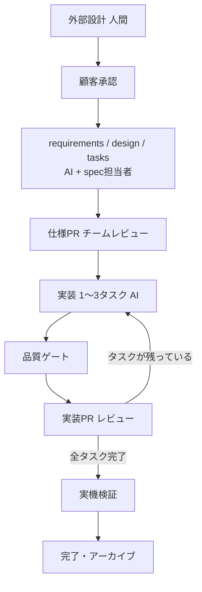

# Quest MRアプリ 仕様駆動開発ガイドライン

**cc-sdd + Claude Code / 少人数チーム / Meta Quest 3 系**

最終更新: 2026-09-21

> この版は公開用に、組織固有の数値（人数、定例の頻度、ライセンスの調達、CI機材の構成）を
> 一般化してある。方法論の部分は元のまま。

---

## 1. 適用範囲とルールの強さ

仕様駆動開発の対象は、テキストで一意に記述でき自動テストで判定できる領域に限る。それ以外は人間がUnity Editorと実機で作る。

| 項目 | 内容 |
| --- | --- |
| チーム | 少人数。Unity実務経験者、Quest/XR経験者、Claude Code実務経験者をそれぞれ含む |
| エンジン | Unity 6 + OpenXR + Meta XR SDK |
| 管理 | Azure DevOps（Boards / Repos / Pipelines） |
| 納品物 | apk + ソース + 外部設計書 |

### 用語

| 用語 | 意味 |
| --- | --- |
| spec | 1機能分の仕様（要件・設計・タスク）。`.kiro/specs/` に置く |
| ステアリング | 全specが共通で読む前提・規約（第5章） |
| 仕様PR | 実装の前に仕様だけを出すPR（第7章） |
| L1〜L4 | 仕様に書くかどうかを決める層の区分（第2章） |
| Stopフック | AIが作業を終えるときに自動でテストを走らせる、Claude Codeの仕組み（第8章） |
| CI | Azure Pipelinesで動く自動ビルド・自動テスト |
| Unity Pipelineパッケージ | CLIから起動中のEditorを操作するためのUnityのパッケージ（`com.unity.pipeline`） |
| eval | 起動中のEditorでC#を即時実行する、Unity CLIの機能 |

### ルールの3区分 — 覚えるのは5つだけ

**① 機械が止める（覚えなくてよい）**

| ルール | 仕組み |
| --- | --- |
| Core層にUnityEngineを入れない | asmdef（コンパイルエラー） |
| テストが通らないものは完了させない | Unity Test Framework（Stopフック + CI） |
| レビュー1名・Work Itemリンク・Squash | ブランチポリシー |
| .meta の欠落・GUID変更 | CI |
| シーンは所有者のレビュー必須 | パス別の必須レビュアー |
| spec・ステアリングの行数 | CI（超過は警告） |
| AIがシーン・プレハブのファイルを直接書き換えない | Claude Codeの権限設定（Bash経由の抜け道は残るので、レビューで拾う） |

**② 人間の鉄則（これだけは覚える）**

1. 仕様に書くのは、テストが書ける数値だけ。見た目は書かない
2. 1つのspecで触るシーンは1つまで
3. 外部設計が先、design.mdは後
4. 実機で直した数値は、コードより先にdesign.mdを直す
5. 画面に出るものは、AIが「完了」と言っても実機で見るまで完了ではない

**③ 目安（外れてよい）**

①②以外はすべて目安。数値が書いてあっても違反で止まることはない。

定例の一部を「SDD振り返り」に充てる。外れ続けている目安は、守らせるのではなく**目安の方を直すか削除する**。ルールを足すときは、まず①にできないかを検討する。**②は5つから増やさない。**

---

## 2. レイヤー境界 — 仕様に書くもの／書かないもの

最も重要な章。ここが崩れると他を守っても破綻する。

| 層 | 中身 | SDD | 検証方法 | 担当 |
| --- | --- | --- | --- | --- |
| L1 Core | ドメインロジック、状態遷移、判定・採点、データモデル | ◎ 全面適用 | EditModeテスト | AI主導 |
| L2 Adapter | Coreとシーンを繋ぐ部分、入力、イベント配線 | ○ テスト可能な範囲 | EditMode + PlayMode | AI主導 + 人間レビュー |
| L3 Spatial | 空間配置、寸法、当たり判定、アニメーション時間 | △ 数値のみ | PlayModeテスト（数値）+ 実機確認 | 人間主導 |
| L4 Presentation | 見た目、演出、マテリアル、体験の質 | ✕ 書かない | 実機確認 | 人間のみ |

L1はAIに完成品を求めてよい。L2・L3でAIが出すのは7〜8割の叩き台で、残りは人間がEditorと実機で仕上げる。見積もりはこの前提で行う。

L1はUnityEngineを参照しないアセンブリに分けてあり、AIがUnity依存を持ち込むとコンパイルが落ちる。テストもアセンブリを分け、Coreは `Tests.EditMode`、Adapterは `Tests.EditMode` と `Tests.PlayMode` で検証する（第8章）。

AIはUnity公式のClaude Codeプラグイン（Unity CLI）経由でEditorを操作する。コードとテストはAIが書き、シーン・プレハブの操作はCLI経由に限る（第10章）。

### L3の書き方 — 「見た目」ではなく「検証可能な数値」

| ✕ 書かない | ○ 書く |
| --- | --- |
| 茶碗が自然な位置にある | 初期位置は基準点から前方0.35m、高さ0.72m、±0.02m |
| 手に取りやすい大きさ | グラブ判定半径0.06m |
| スムーズな遷移演出 | フェード0.4秒、EaseInOutCubic |
| 見やすいUI | 視点から1.2m、視野角±15°以内、文字高0.012m以上 |
| 快適な移動 | スナップターン30°、加速なし、ビネット有効 |

判定基準は一つ。**その記述からテストが1本書けるか。** 書けないなら仕様ではなく実機確認項目に回す。

### L4は仕様に書かない

マテリアル、ライティング、パーティクル、サウンド、アニメーションカーブは、参照画像・動画を `docs/references/` に置き、design.mdからはパスで示すだけにする。この領域の値はAIに変更させない。

---

## 3. ドキュメントの置き場所

内部設計（AI向け）と外部設計（顧客向け）は別ディレクトリに置き、同じファイルに同居させない。

| 場所 | 中身 | 更新者 | 顧客に見せるか |
| --- | --- | --- | --- |
| `.kiro/steering/` | プロジェクト共通の前提・規約 | テックリード（PR必須） | ✕ |
| `.kiro/specs/<spec>/` | 機能ごとの要件・設計・タスク | AI + spec担当者 | requirementsの要約のみ |
| `.kiro/archive/` | 完了したspec | spec担当者 | ✕ |
| `docs/external/` | 外部設計（納品物） | 人間のみ | ◎ |
| `docs/references/` | 視覚リファレンス（画像・動画） | デザイナー・実装者 | 一部 |
| `docs/verification/` | マイルストーンの実機検証記録 | 検証者 | 必要に応じて |

---

## 4. 環境セットアップ

手順とコマンドはリポジトリのREADMEとセットアップスクリプトに置き、本書には方針だけを書く。テックリードが一人で通してから全員に配る。

| 項目 | 方針 |
| --- | --- |
| Unity | 全員同じバージョンに固定する |
| Unity連携 | Unity公式のClaude Codeプラグイン（スキル・Unity CLI・MCPサーバー）だけを使う。Unity CLI Loopやサードパーティ製のUnity MCPは併用しない |
| Editor操作 | プロジェクトにUnity Pipelineパッケージ（`com.unity.pipeline`）を入れ、CLIから起動中のEditorを操作できるようにする |
| IDE | VS Codeを標準とする（Claude Codeの公式拡張あり）。難しいデバッグのときだけVisual Studioを併用してよい。コード規約は `.editorconfig` で揃える |
| バージョン | Unity CLIとプラグインのバージョンをREADMEに固定する。Unity CLIはbeta、Unity Pipelineパッケージは実験版で、コマンドが変わりうる |
| cc-sdd | テックリードが1回だけ導入してコミットする。各自で実行しない |
| Azure DevOps | 公式MCPサーバーを使い、読み込む範囲はWork Itemとリポジトリに限る |
| AIの権限 | Work Itemの読み書きとコードの読み取りのみ。ビルド・リリース権限は渡さない |
| ライセンス | IDEの一部は組織の規模によって有償になる。CI用マシンのUnityライセンスも別途要る |

### 初日チェックリスト

- [ ] 全員が同じUnityバージョンでプロジェクトを開ける
- [ ] 全員がQuest実機にビルド・デプロイできる
- [ ] 全員のClaude CodeからUnity CLIでEditorに接続できる（`unity doctor` で確認）
- [ ] 全員のClaude CodeからWork Itemを読める
- [ ] Claude Codeの権限設定で、シーン・プレハブ・.metaの直接編集が拒否される
- [ ] Git LFS と Unity用マージ設定が全員の環境に入っている
- [ ] mainのブランチポリシーが設定済み

---

## 5. ステアリング

ステアリングは全specが毎回読む共通前提。書いたものは常にAIのコンテキストに載るので、3ファイル合計400行までに絞る。

| ファイル | 書く | 書かない |
| --- | --- | --- |
| product.md | 目的、対象ユーザー、中核体験、用語集 | 機能一覧、進捗 |
| tech.md | Unity構成、層の境界、命名、禁止事項 | ライブラリの解説 |
| structure.md | ディレクトリとレイヤーの責務、シーン名 | クラスの説明、実装状態 |

書くのは**半年後も真であること**だけ。進捗、実装済み機能、TODO、特定specの詳細は書かない。書いた瞬間から古くなり、全specに誤った前提が伝わる。

変更は必ずPRにし、テックリードがレビューする。実装中に「ルールが足りない」と思っても、その場で足さず、specを閉じてから起票する。

---

## 6. spec分割

specは大きくなるとAIが手順を飛ばし始める。1specは約1週間で閉じる大きさにする。

| ファイル | 上限の目安 |
| --- | --- |
| design.md | 800行 |
| tasks.md | 300行 |
| requirements.md | 250行 |

超過はCIが警告し、1.5倍を超えると止める。

### 分割の切り口（優先順）

1. レイヤー — CoreとAdapterは別spec。Coreだけで閉じるspecを先に作る
2. シーン — 1specが触るシーンは1つまで
3. 技術 — 永続化、入力、UIは別spec
4. ドメイン — 業務上独立した機能単位

| ✕ 悪い | ○ 良い |
| --- | --- |
| main-experience（中核体験を1つに） | session-state-core / session-flow-adapter / session-scene-setup |
| ui（UI全部） | settings-panel / progress-hud / result-panel |
| phase-1 / phase-2（時間で割る） | 機能で割る |

命名は `<domain>-<layer>`（例：`scoring-core`）。名前を見ればどの層を触るか分かるようにする。

依存するspecは requirements.md の冒頭に1行で書く。依存が3つ以上あるなら分割を間違えている。

---

## 7. 開発フロー

仕様は実装前に仕様PRとして出し、チームが読める状態にする。

### PR

- 仕様PRは `.kiro/specs/` の3ファイルだけを含める
- 実装PRは1〜3タスク、差分400行程度まで（.meta・シーン・プレハブは除く）
- PR説明の先頭に `#<Work Item ID>` を書く（Work Itemに自動リンクされる）
- マージはsquash

### 並列度とレビュー

同時進行は3spec、1人1specが目安。実装者以外の1名がレビューし、シーンを含むPRはそのシーンの所有者がレビューする。レビュー待ちが常時5件を超えたら、新しいspecに着手せずレビューに回る。

### 使うコマンド

cc-sddの標準コマンドをそのまま使い、独自拡張はしない（例外は付録B）。

| コマンド | 用途 |
| --- | --- |
| `/kiro:spec-init` | spec作成 |
| `/kiro:spec-requirements` | 要件定義 |
| `/kiro:spec-design` | 技術設計 |
| `/kiro:spec-tasks` | タスク分解 |
| `/kiro:spec-impl <spec> <task>` | 実装。必ずタスク番号を指定する |
| `/kiro:validate-gap` | 仕様と実装の乖離検出（spec完了時） |

Unityの操作は公式プラグインのスキル（`/unity-cli`、`/unity-package-management`、`/physics-3d-collision`、`/ui-ugui` など）に任せる。**Unity公式プラグインにはXR・Meta Quest向けのスキルがない**ので、Meta XR SDKを使うコードはAIが誤りやすい。designの段階で付録Bのverify-apiを通す。

---

## 8. 品質ゲート

AIの「テストが通りました」は信用しない。判定は機械に任せる。

### ゲート

| 段 | 仕組み | 判定 | 失敗時 |
| --- | --- | --- | --- |
| 1 | Stopフック | コンパイル、EditModeテスト | AIの作業を完了させない |
| 2 | CI（Azure PipelinesでのPR検証） | 上記 + PlayModeテスト + Androidビルド | マージ不可 |
| 3 | 人間の実機検証 | 第9章 | specを完了させない |

導入は1段目から順に進め、全員が揃う前に1段目と2段目のEditModeまでは動かしておく。CIはUnityライセンスの都合で、専用マシン1台で回す構成を前提にする。

### テストの範囲

| 層 | 必須ライン |
| --- | --- |
| Core | publicメソッドにテストがある。なければマージしない |
| Adapter | 主要経路のみ |
| Spatial | 第2章で数値化した項目のみ |
| Presentation | なし（実機で担保） |

カバレッジの数値目標は置かない。Coreにテストが書けないなら設計がUnityに依存しているので、テストを諦めず設計を直す。tasks.mdの各タスクに完了条件（通すべきテスト）が書かれているかは、仕様PRで確認する。

### Unity Test Frameworkの書き方と実行

テストはすべてUnity Test Framework（UTF）で書く。

| 項目 | ルール |
| --- | --- |
| アセンブリ | `Tests.EditMode`（対象はEditorのみ、CoreとAdapterを参照）と `Tests.PlayMode`（Adapterを参照）を分ける。EditModeとPlayModeは同じアセンブリに置けない |
| 属性 | 原則 `[Test]`。フレーム待ちや時間経過が必要なときだけ `[UnityTest]` |
| 命名 | テストクラスは `<対象クラス名>Tests` |
| XR依存 | XRの入力はインターフェース越しに受け、PlayModeテストでは差し替える。XRランタイムに依存したテストはCIで動かない |

実行する場所によって方法を分ける。

| 場所 | 実行するテスト | 方法 |
| --- | --- | --- |
| ローカル（Stopフック・AI） | EditModeのみ | Unity CLI経由で、開いているEditorで実行 |
| ローカル（人間） | 任意 | Test Runnerウィンドウ |
| CI | EditMode + PlayMode | バッチモードで実行し、NUnit形式の結果をAzure Pipelinesのテスト結果に表示 |

StopフックではPlayModeテストを回さない。開いているEditorがPlayモードに入り、人間の作業を止めるため。CIは実験版のUnity Pipelineパッケージではなく、実績のあるバッチモード実行を基本にする。Editorで開いているプロジェクトにはバッチモードを実行できないので、ローカルはCLI経由、CIはバッチモード、と使い分ける。

### Unity CLIの使用範囲

`unity command eval`（起動中のEditorでC#を即時実行する機能）はローカル開発でのみ使う。CIでは使わず、Player側のUnity Pipelineパッケージは開発ビルドに限り、製品ビルドには含めない。

---

## 9. 実機検証

AIはQuestを被れない。L2以上を含むspecは、実機で見るまで完了にしない（Core層だけのspecは不要）。

**spec完了時（5分）** — 結果はPRコメントに数行で残す

- [ ] 実機で起動し、対象機能まで到達できる
- [ ] 操作中に目立ったフレーム落ちがない
- [ ] requirements.md の受け入れ条件どおりに動く

**マイルストーン時（30分・顧客承認の前）** — 結果は `docs/verification/` に残す

- [ ] 72fpsを維持する（OVR Metrics Tool）
- [ ] パススルー表示が破綻しない（境界、遮蔽、明るさ）
- [ ] 対象物に手が無理なく届く（座位・立位）
- [ ] 視線を大きく動かさずに情報が読める
- [ ] UIテキストが実機で読める
- [ ] 5分間の連続使用で酔い・疲労が出ない
- [ ] Guardian境界付近で挙動が破綻しない
- [ ] 再起動しても状態が壊れない

実機で数値を直すときは、**コードより先にdesign.mdを直す。**

### AIにやらせないこと

| 領域 | 理由 |
| --- | --- |
| 快適性の判断（酔い、疲労、距離感） | 身体感覚が必要 |
| マテリアル・ライティングの調整 | パススルー下の見え方は実機でしか分からない |
| アニメーションの「自然さ」 | 数値化できない |
| Guardian境界まわりの確認 | 実空間に依存する |

---

## 10. シーン・プレハブ

並列開発で最も起きやすい事故。シーンとプレハブの競合はマージで解決できないので、起こさない仕組みにする。

1. **所有者を決める** — 各シーンに所有者を1名決め、パス別の必須レビュアーに設定する。「ロック中」のような状態は管理しない
2. **1specで触るシーンは1つまで**
3. **シーンを薄く保つ** — シーンに直接置かずプレハブで構成し、設定値はScriptableObjectに出す
4. **共通プレハブはVariantで分ける** — Baseを複数人で直接編集しない
5. **AIのシーン・プレハブ操作はUnity CLI経由に限る** — ファイルの直接書き換えは禁止

| 対象 | AIに許すこと |
| --- | --- |
| シーンの構造変更 | そのシーンの所有者自身のセッションでのみ可 |
| プレハブ・ScriptableObject | 誰のセッションでも作成・変更可（共通プレハブのBaseは除く） |
| 見た目の値（L4） | 変更不可 |

AIがCLIでシーンを操作している間、Editorはそのシーンを開いたまま接続している必要がある。同じEditorで人間が並行して作業しない。

### シーン・プレハブを含むPRのレビュー

.metaの欠落やGUIDの変更はCIが止める。人間は次を確認する。

- [ ] Unity Editorで対象シーンを開いた
- [ ] Missing Script / Missing Reference が出ていない
- [ ] Hierarchyの構造がPR説明と一致している
- [ ] Prefabのオーバーライドが意図したものだけ

PR説明には「変更したシーン・プレハブ」と「Editorでの確認手順」を書く。競合してしまったら、手でマージせず片方を破棄して作り直す。

Editorで保存すると再シリアライズで無関係な箇所まで差分が出ることがある。シーンを含むPRは小さく保ち、差分が大きいときはPR説明に理由を書く。

---

## 11. 顧客向け外部設計

外部設計を先に顧客と合意し、それを入力にAIが内部設計を書く。逆はしない。実装で分かった数値の修正はdesign.mdに、体験そのものの変更は外部設計に戻して承認を取り直す。

| ファイル | 内容 | 主な表現 |
| --- | --- | --- |
| 01-overview | 目的、対象ユーザー、利用シーン、前提機材 | 文章 |
| 02-user-flow | 体験の流れ、シーン遷移 | 図 |
| 03-screens | 各画面・空間 | スクリーンショット |
| 04-interactions | 操作方法 | 図 + 文章 |
| 05-nonfunctional | 動作環境、性能目標、安全配慮 | 表 |
| 06-scope | 対応範囲と対象外 | 箇条書き |

06-scopeは必ず作る。受託で最も揉めるのは「入っていると思っていた」である。

- 顧客向けにパラメータは書かない（「グラブ判定半径0.06m」ではなく「手を伸ばして掴む」）
- 図とスクリーンショットを主にする
- 用語はステアリングの用語集と揃える

### 承認

spec単位ではなく、顧客が理解できる機能のまとまりで承認を取る。

| 回 | 対象 |
| --- | --- |
| 第1回 | 全体構成・体験の骨子・対象範囲 |
| 中間 | 実装済み機能の実機デモと残り範囲の確認。仕様変更を受け付ける最後の機会 |
| 最終 | 全体・受入条件 |

第1回が遅れると、全員が揃っても着手できるspecがない。ここがスケジュールの急所になる。顧客に出す版はgitタグを打ってからdocx・PDFに変換し、どの版を説明したか後から追えるようにする。

---

## 12. 仕様を古くしない

- 完了したspecはすぐ `.kiro/archive/` に移す（完了PRに含める）。古い仕様をAIが参照しなくなる
- spec完了時に `/kiro:validate-gap` を実行し、乖離があれば間違っている側を直す
- ステアリングは顧客承認のタイミングで15分読み合わせ、読まれていないルールを削る
- AIの挙動が不安定でも、ルールを足す前にspecを分割する。ルール追加は肥大化の入口になる

---

## 13. 進め方

少人数で型を固めてから全員に展開する。

| フェーズ | 体制 | やること | 次へ進む条件 |
| --- | --- | --- | --- |
| 立ち上げ | テックリード（＋XR経験者） | 環境構築、パイロットspec、品質ゲート、外部設計 | 顧客第1回承認、着手可能な仕様PRが3本 |
| 展開 | 全員 | 読み合わせ、実装、定期的な振り返り | 中間承認 |
| 収束 | 全員→縮小 | 機能凍結、不具合修正、外部設計の最終化、納品物作成 | 最終承認・納品 |

### 立ち上げのチェックリスト

- [ ] Core層を分離したプロジェクト構成
- [ ] Unity公式プラグインとUnity Pipelineパッケージを導入し、Claude Codeの権限設定でシーン・プレハブの直接編集を拒否する
- [ ] cc-sdd導入、ステアリング作成
- [ ] パイロットspec（Core層のみ・シーンなし）を1周し、Adapter＋シーン1つのspecも試す
- [ ] 品質ゲート1段目と2段目（EditMode）を動かす。ローカルのCLI経由のテスト実行が安定するか確かめる
- [ ] Work Itemの階層・タグ規約とブランチポリシーを決める
- [ ] 外部設計の第1回承認を取る
- [ ] **全員が着手できる仕様PRを3本作り溜める**
- [ ] パイロットで分かったことを本書に反映する

### 撤退判断

全員稼働の2週目に次のいずれかが当てはまれば、SDDの適用をCore層に限定するか、通常のAI駆動開発に戻す。判断は先送りしない。

| 指標 | 危険水準 |
| --- | --- |
| PRレビュー待ち | 常時5件以上 |
| 実機検証の差し戻し | specの半数以上 |
| 体感的な開発速度 | 従来より遅い |

見積もりにAIによる高速化を織り込みすぎない。実装は速くなっても、仕様レビュー・実機検証・顧客承認は人間の速度でしか進まない。

---

## 付録A. Azure DevOps

Boardsは進捗の一覧、Repos（PR）は中身の議論に使う。仕様の本文はWork Itemにコピーしない。

| 階層 | 中身 | 起票者 |
| --- | --- | --- |
| Epic | 顧客承認単位の機能まとまり | 人間 |
| Feature | 1 spec | AI（spec作成時に1回） |
| Task | 起票しない（tasks.mdが正） | — |
| Bug | 不具合 | 人間のみ |

- AIが起票したWork Itemには `created-by: ai` タグを付ける
- 状態はspecの段階が変わったときだけ更新する（New → Active → Resolved）
- Work Itemに書くのはspecへのリンクと3行の要約だけ

| ブランチポリシー（main） | 設定 |
| --- | --- |
| 最小レビュアー | 1名、作成者の承認は数えない |
| Work Itemのリンク | 必須 |
| ビルド検証 | 必須 |
| コメント解決 | 必須 |
| マージ方式 | Squashのみ |
| パス別の必須レビュアー | シーンごとの所有者 |

---

## 付録B. 追加するカスタムコマンド

cc-sddのフローに足すコマンドは次の1つだけ。

**`/unity:verify-api`**（Claude Codeのスラッシュコマンド） — design.mdに書かれたUnity・Meta XR SDKのAPIが、導入済みのバージョンに実在するかを調べる。中身は、Unity側に `[CliCommand]` で用意した確認コマンドを呼び出し、起動中のEditorに型とメソッドの存在を問い合わせる（ファイル検索より正確）。AIは古いAPIや存在しないAPIを自信を持って書くので、見つからないAPIが1件でもあればdesignを承認しない。仕様PRのレビュー前に実行する。

これとは別枠で、Unity側にはAIの動作確認用のコマンドを `[CliCommand]` で追加してよい（例：ゲーム状態の出力、テスト用の敵の出現）。cc-sddのフローは変えないので、上の「1つだけ」には数えない。evalで場当たり的に調べさせるより、AIにできることが明確になり、レビューもしやすい。

コードからUnity固有の前提を集めて仕様を書かせるコマンド（QualiArtsの事例）は、コードベースが育ってから検討する。

---

## 付録C. 参考資料

Unity特化のSDD書籍はまだない。書籍は原則の共通言語に使い、Unity固有の部分は記事と本書で補う。

| 資料 | 位置づけ | 読む人 |
| --- | --- | --- |
| [Unity「Official Unity Plugin for Claude Code」](https://unity.com/blog/unity-plugin-for-claude-code) | 公式プラグインの中身とスキル一覧 | 全員 |
| [Unity「Meet the Unity CLI」](https://unity.com/blog/meet-the-unity-cli) | Unity CLI・Unity Pipelineパッケージ・evalの仕組み | 全員 |
| 『仕様駆動開発 実践入門 〜AIで実現する開発方法論』田中秀樹・田中秀彦（日経BP） | 方法論と組織展開の共通言語 | テックリード |
| 『AI駆動開発入門』佐藤智樹 | ツールと工程の整理。入門・共有用 | 任意 |
| [CyberAgent「Unityクライアント環境におけるSDD活用事例」](https://developers.cyberagent.co.jp/blog/archives/62404/) | spec分割・品質ゲートの根拠 | 全員 |
| [QualiArts「UnityにおけるAIエージェントの活用術」](https://technote.qualiarts.jp/article/101/) | Unity向けカスタムコマンド | テックリード、XR経験者 |
| Zenn「Unity × Claude Code AI駆動開発をしてみよう」 | AIに任せる範囲の実感値 | 全員 |
| Tanuj Arora「Spec-Driven Development in Game Dev」（英語） | 仕様フォルダの運用 | 任意 |
| watany「仕様駆動開発の消費期限」（登壇資料） | 仕様の陳腐化 | テックリード |

展開時の読み合わせでは、本書の第1章とCyberAgentの事例を全員で読む。
